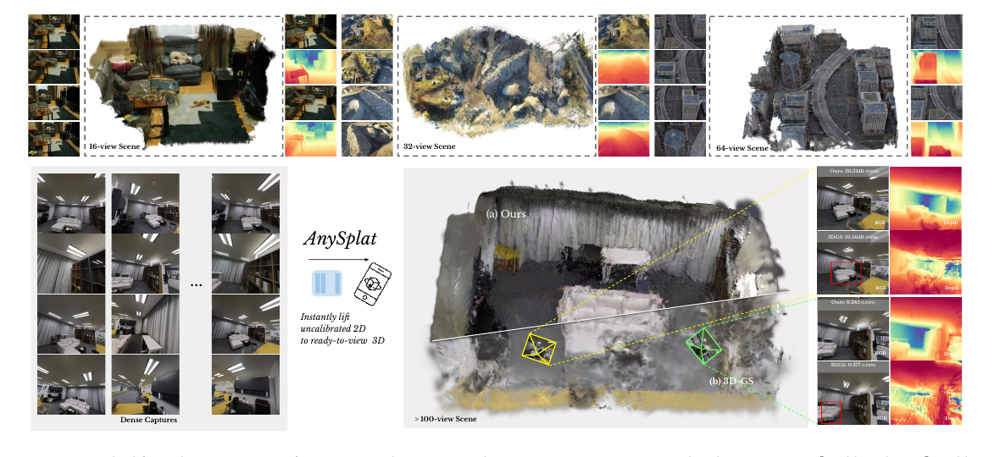
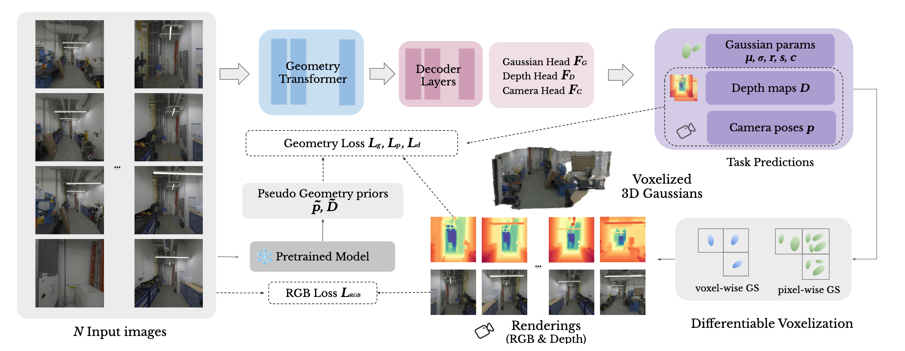
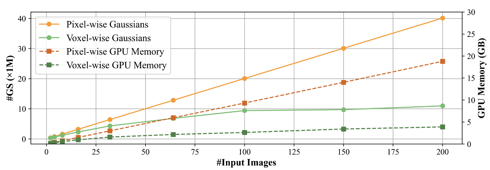
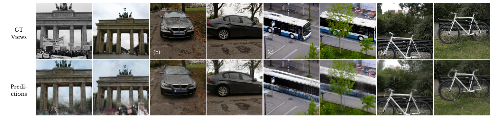

# AnySplat: Feed-forward 3D Gaussian Splatting from Unconstrained Views

arXiv：[2505.23716](https://arxiv.org/abs/2505.23716)；项目页：[AnySplat](https://city-super.github.io/anysplat/)；代码：[InternRobotics/AnySplat](https://github.com/InternRobotics/AnySplat)；DOI：[10.1145/3763326](https://doi.org/10.1145/3763326)

论文：[Jiang 等 - 2025 - AnySplat Feed-forward 3D Gaussian Splatting from Unconstrained Views.pdf](/Users/pro/Desktop/🤖.ai/暑期论文阅读/key_baseline/Jiang%20等%20-%202025%20-%20AnySplat%20Feed-forward%203D%20Gaussian%20Splatting%20from%20Unconstrained%20Views.pdf)

## 开始前复习一下知识点

### 1. 未标定多视图、反投影与尺度规范

对像素齐次坐标

$$
\tilde x=(u,v,1)^\top,
$$

若已知内参 $K$、深度 $D_i(u,v)$ 与 camera-to-world pose $(R_i,t_i)$，其三维点可写为

$$
X_{\mathrm{cam}}
=
D_i(u,v)K^{-1}\tilde x,
\qquad
X_{\mathrm{world}}
=
R_iX_{\mathrm{cam}}+t_i.
\tag{1}
$$

AnySplat 把每张图的内外参压缩为 $p_i\in\mathbb R^9$，但论文没有在正文展开这九维的具体参数化。它固定第一张图的 pose 为 identity，其他相机都表示在该共享局部坐标系中。

这意味着它解决的是**相对几何与相对位姿**。在纯 RGB、未知基线的设定中，若同时把场景深度和相机平移乘以同一正数 $a$，

$$
D\mapsto aD,
\qquad
t\mapsto at,
$$

透视图像在理想情形下并不能区分这两个尺度。因此，未标定多视图不是天然具有绝对米制尺度的任务。论文的 test-time scale alignment 只用于计算渲染指标，不能被误读为恢复了真实世界的绝对尺度。

### 2. 三种深度与两种 confidence 

AnySplat 中有三个看起来都像深度的量：

| 记号 | 来源 | 角色 |
|---|---|---|
| $D_i$ | 学生的 DPT depth head | 每视图预测深度，用来反投影 Gaussian center |
| $\hat D_i$ | voxelized 3D Gaussians 的渲染器 | 整个共享 3D 场景从第 $i$ 个相机看到的深度 |
| $\tilde D_i$ | 冻结的预训练 VGGT | teacher 伪深度，提供外部几何先验 |

同样，$C_i^D$ 与 $C_g$ 也不是同一回事：

- $C_i^D$ 是 depth head 的像素级置信度。论文用其最高的 $30\%$ 像素构造 mask $M$，避免在天空、反射面等困难区域强行施加几何一致性；
- $C_g$ 是每个 pixel-wise Gaussian 的置信度。它经 softmax 后成为同一 voxel 内 Gaussian 属性聚合的权重。

这一区分很重要：AnySplat 的 $M$ 不是 VGGT teacher 的不确定性估计，也不是 DA3 式的 RANSAC 标注去噪。它首先是学生内部几何约束的 self-gating。

## Introduction

### 1. 研究背景

从多视图 RGB 得到可渲染三维场景，传统流程通常是

$$
\{\text{images}\}
\to
\text{feature matching / SfM}
\to
\text{poses + sparse structure}
\to
\text{MVS 或 per-scene NeRF/3DGS optimization}.
$$

这条链在高质量、静态、纹理充足且拍摄有充分重叠的场景中非常强，但它有三个工程瓶颈：

1. **标定和注册成本。** 3DGS / NeRF 通常假定准确相机 pose；COLMAP 等 SfM 预处理既耗时，又会在弱纹理、重复纹理、大视角变化、反射面或不规则采集时不稳定。
2. **逐场景优化成本。** 每来一个新场景都要重新优化；输入帧越多、目标分辨率越高，时间和显存压力越大。
3. **几何模型与可渲染资产之间的缺口。** 现代几何 foundation model 能快速输出 point map 或深度，却可能有跨视图错位、细节 / 纹理不足；反过来，纯 rendering loss 又可能拟合输入视图而没有正确三维几何。

AnySplat 的目标不是重新定义 SfM、MVS 或 3DGS，而是把几何 foundation model 的先验、显式 Gaussian 表示和渲染反馈串成一个未标定输入的端到端管线。

### 2. 现有路线的局限

论文指出三类相邻方法各有缺口：

1. **优化式 NVS。** 画面质量强，但往往需要已知相机和场景级优化。
2. **通用三维几何模型。** 可同时预测深度、point map 和 pose，却在细节、写实渲染与多视图一致性上仍有缺口，尤其在高重叠输入下可能产生错位或噪声。
3. **pose-free 前馈 NVS。** 去除了部分先验，但此前多限于 2 到 24 张的 sparse-view 输入；直接让每个像素对应一个 Gaussian 时，dense views 会带来近线性的 primitive 和显存增长。

这里应避免夸张为“传统方法无法重建”。传统方法可以用更可靠的标定、更多迭代和更强的工程配置克服部分困难；AnySplat 的贡献是降低它们在同一系统中同时满足“无标定、低延迟、稠密输入、可渲染”的门槛。

### 3. 本文的核心贡献

1. **无标定、前馈式 3DGS。** 从单张到数百张未标定图像，联合预测 3D Gaussian 和相机内外参。
2. **Pseudo-label knowledge distillation。** 使用预训练 VGGT 的伪 pose 与伪 depth 作为外部几何锚，不需要直接使用带噪的 SfM/MVS 三维监督。
3. **可渲染的几何一致性闭环。** 让学生 depth head 与完整 Gaussian 场景渲染出的深度保持一致，以抑制多视图 lift/aggregation 后的 layered sheets。
4. **Differentiable voxelization。** 在可导的前提下合并冗余 pixel-wise Gaussians，使稠密输入的表示规模和渲染显存更可控。

论文中列出的 DINOv2、VGGT、DPT、3DGS rasterizer、SH 以及 voxel aggregation 都不是单独首次提出。新意主要在于它们如何围绕 pose-free、dense-view、可渲染重建这一目标形成闭环。

## Method

### 1. 总体流程与输出接口

给定 $N$ 张未标定图像

$$
\{I_i\}_{i=1}^{N},
\qquad
I_i\in\mathbb R^{H\times W\times3},
$$

AnySplat 先产生每帧的相机参数与像素深度，再把深度反投影为 pixel-wise Gaussian centers，预测其余 Gaussian 属性，最后做 voxel aggregation 与 differentiable Gaussian rasterization：

$$
\{I_i\}
\xrightarrow{\text{geometry Transformer}}
\{\text{tokens}\}
\xrightarrow{F_D,F_C,F_G}
\{D_i,p_i,\text{pixel-wise GS}\}
\xrightarrow{\text{voxelization}}
\mathcal G
\xrightarrow{\text{rasterization}}
\{\hat I_i,\hat D_i\}.
\tag{3}
$$

三个输出 head 的职责是：

| head | 输出 | 为什么需要它 |
|---|---|---|
| $F_D$ | $D_i,C_i^D$ | 给出像素几何与其可靠性 |
| $F_C$ | $p_i$ | 把各图放进同一局部坐标系 |
| $F_G$ | opacity、rotation、scale、SH color、$C_g$ | 把几何变成能够写实渲染的 Gaussian scene |

因此，$D_i$ 不是最终资产，$\mathcal G$ 才是；深度和相机只是把二维观测 lift 到共享三维表示所需的中间变量。

### 2. Geometry Transformer 与三头预测

论文沿用 VGGT 风格的几何编码器。每张图先以 patch size $p=14$ 切分，使用 DINOv2 得到维度 $d=1024$ 的 image tokens。每帧 token 序列中还放入：

- 一个 learnable camera token；
- 四个 register tokens；
- 对第一张图，这些全局 token 不加位置编码，使其可作为局部坐标参考。

共有 $L=24$ 层 Alternating-Attention。每层先在单帧内部做 frame attention，再让所有视图的 token 一起做 global attention。前者保留图像内部结构，后者建立跨视图对应和全局布局。

相机 token 经过额外四层 self-attention 与线性投影得到 $p_i$。depth head 是 DPT decoder：

$$
(D_i,C_i^D)=F_D(\hat t_i^I).
\tag{4}
$$

其中 $\hat t_i^I$ 是编码后的 image tokens。Gaussian head 把 DPT 特征与浅层 CNN 提取的外观特征相加后，再用回归 CNN 预测其余属性：

$$
\{\sigma_g,r_g,s_g,c_g,C_g\}
=
F_b\left(
F_d^2(\{\hat t_i^I\})+F_a(\{I_i\})
\right).
\tag{5}
$$

这个双来源设计有直观意义：Transformer 特征偏向几何与跨视图上下文，浅层 CNN 特征保留高频局部外观；只用其中之一都会更容易丢失另一类信息。

### 3. 从深度和相机到 pixel-wise Gaussians

深度与预测相机共同给出 Gaussian center：

$$
\{\mu_g\}
=
\mathrm{proj}(\{p_i\},\{D_i\}).
\tag{6}
$$

从几何角度看，这一步实质上是式 (1) 的反投影。论文写作 $\mathrm{proj}$，但它的作用是把像素及其深度 lift 到三维。

这带来一个风险：若每张 $H\times W$ 图都产生一个 Gaussian，则 primitive 数约为

$$
G\approx N\times H\times W.
$$

在 sparse views 中尚可接受；输入视图增加后，大量不同像素会预测到同一表面附近，既浪费显存，也会形成重叠 primitive 所致的渲染伪影。这正是下一个模块存在的原因。

### 4. Differentiable Voxelization：把稠密输入变得可扩展

设 voxel 边长为 $\epsilon$。每个 Gaussian 依其中心落进一个离散 voxel：

$$
V_g
=
\left\lfloor
\frac{\mu_g}{\epsilon}
\right\rfloor.
\tag{7}
$$

如果某个 voxel $s$ 中有多个 Gaussian，论文不做不可导的硬选择，而是把每个 Gaussian 的 confidence $C_g$ 转成 softmax 权重：

$$
w_{g\to s}
=
\frac{\exp(C_g)}
{\sum_{h:V_h=s}\exp(C_h)}.
\tag{8}
$$

任意属性 $a_g$ 的 voxel 级聚合为

$$
\bar a_s
=
\sum_{g:V_g=s}w_{g\to s}a_g.
\tag{9}
$$

这是一种可微的、learned weighted consolidation，而不是单纯基于距离的硬去重。它通过训练学习“同一局部空间中哪一个预测更可信”，从而减少冗余并保留梯度。

Figure 5 给出论文最直接的效率证据：未做 voxelization 时，Gaussian 数量和渲染显存随输入视图数近似线性增长；使用该模块后，增长次线性并趋于平台。论文贡献中概括为跨场景可去除约 $30\%$ 到 $70\%$ 的冗余 primitive。这个百分比是整体主张，不应误读为每个实验、每个视图数都固定节省相同比例。

一个复现层面的待确认点是：论文给出了属性的加权聚合公式，但没有详细展开四元数聚合时的归一化和符号一致性处理；这在实现中需要特别检查。

### 5. Pseudo-label knowledge distillation

只用输入视图 RGB 重建会有一个典型坏解：网络可以生成从输入相机看似正确的图像，却使用错误深度和错误相机，只是在每个输入视角各自“糊弄过去”。尤其当 pose 和 depth 同时预测时，误差在 lift 到三维后会互相补偿。

AnySplat 因此从冻结的预训练 VGGT 获得

$$
\tilde p_i,\qquad \tilde D_i,
$$

并使用两项蒸馏：

$$
L_p
=
\frac{1}{N}\sum_{i=1}^{N}
\left\|
\tilde p_i-p_i
\right\|_{\epsilon},
\tag{10}
$$

$$
L_d
=
\frac{1}{N}\sum_{i=1}^{N}
\left(
\tilde D_i[M]-\hat D_i[M]
\right)^2.
\tag{11}
$$

$L_p$ 使用 Huber loss。它在小残差时像平方误差、在大残差时近似线性，因此单个 teacher pose 异常不会像纯 $\ell_2$ 一样产生过大的梯度。

这里有三个严格的边界：

1. VGGT 直接提供的是 pose 与 depth，不是被直接蒸馏的纹理 feature。AnySplat 的外观主要由真实输入 RGB 的 rendering loss 学习。
2. $\tilde D_i$ 对齐的是**Gaussian rendered depth** $\hat D_i$，不是只对齐 depth head 的 $D_i$。因此 teacher 被用于约束可渲染三维表示。
3. 这不是 teacher 无条件正确的证明。论文没有给 VGGT 伪标签显式的 uncertainty weighting 或筛除机制；在遮挡、低纹理、反光等图像证据不足的区域，teacher 的系统性偏差仍可能成为学生的软瓶颈。

学生并非只复刻 teacher，因为它还受真实 RGB、多视图共享 Gaussian 和内部一致性约束。不过，如果把 $L_p,L_d$ 权重调得无限大，teacher 的输出就会近似成为硬上限。AnySplat 实际采用的是有限权重的折中，而不是从理论上保证学生总能超过 VGGT。

### 6. Geometry consistency

令 $D_i$ 为 depth head 输出，$\hat D_i$ 为从完整 Gaussian scene 渲染回第 $i$ 个相机的深度。论文以最高 $30\%$ 学生深度置信像素构成 $M$，并使用

$$
L_g
=
\frac{1}{N}\sum_{i=1}^{N}
\left(
D_i[M]-\hat D_i[M]
\right)^2.
\tag{12}
$$

它解决的是 representation mismatch：

- $D_i$ 可以在二维图中看起来合理；
- $\hat D_i$ 检验这些预测是否真的被同一个三维 Gaussian scene 支持；
- 两者不一致时，常会在点云中形成 layered sheets，在新视角中表现为漂浮面、重影或错误遮挡。

注意，$L_g$ 是学生内部的 render-depth consistency；$L_d$ 才是 teacher-to-rendered-depth distillation。式 (11) 也写作 $[M]$，最自然的读法是复用式 (12) 的 mask，但论文没有再次显式定义该实现细节，复现时应核对代码。

### 7. 总损失、训练、推理与可选后优化

RGB rendering loss 为

$$
L_{\mathrm{rgb}}
=
\mathrm{MSE}(I,\hat I)
+
\lambda_1\mathrm{Perceptual}(I,\hat I),
\tag{13}
$$

总目标为

$$
L
=
L_{\mathrm{rgb}}
+
\lambda_2L_g
+
\lambda_3L_p
+
\lambda_4L_d.
\tag{14}
$$

论文实现取

$$
\lambda_1=0.05,\qquad
\lambda_2=0.1,\qquad
\lambda_3=10,\qquad
\lambda_4=1.
$$

这里 $\lambda_3$ 很大，说明 pose distillation 是训练稳定性的强锚；也解释了为什么不能把 VGGT 的影响轻描淡写。

训练使用 Hypersim、ARKitScenes、BlendedMVS、ScanNet++、CO3D-v2、Objaverse、Unreal4K、WildRGBD、DL3DV 九个数据集，覆盖真实 / 合成、室内 / 室外、物体级到城市场景。每步随机采样 2 到 24 帧，最长边为 448；geometry transformer 与 depth DPT head 从 VGGT 初始化，patch embedding 冻结，其余部分继续训练。

论文正文中的训练成本有两种说法：贡献段称在 8 到 16 张 GPU 上可在一天内训练，而 implementation 段给出的具体设置是 16 张 A800、15k steps、约两天。更稳妥的结论是：它把**推理**变为秒级，但大规模训练仍然昂贵。

#### 7.1 Test-time pose alignment 只用于指标

论文在计算渲染指标时，将 context views 和 target views 都作为输入，比较二者集合的平均 context scale，并用比例 $s/\hat s$ 归一化 target scale。它的目的在于公平评测相对重建，而不是在部署时额外获得真实标定，也不是绝对尺度恢复机制。

#### 7.2 Optional post-optimization

前馈结果之后，作者可剪除 opacity 小于 $0.01$ 的 Gaussian，再在输入相机视图上以 MSE 和 SSIM 反传优化 Gaussian 与相机参数。这一步在 dense views 下尤其有效。

它揭示了一个重要事实：AnySplat 的价值不是“从此不需要 optimization”，而是“从强前馈初值开始，用少量优化换取进一步质量”。这一点在实验中非常明显。

## Experiments

### 1. 评价设置应如何读

论文评价三类能力：

1. sparse-view 和 dense-view novel-view synthesis；
2. 相对相机 pose estimation；
3. 多视图几何一致性。

NVS 采用 PSNR、SSIM 和 LPIPS：

- PSNR 高通常表示逐像素误差小；
- SSIM 高表示结构相似；
- LPIPS 低通常更接近人感知的外观。

三者并不总是一致。例如模型可能 PSNR 略低，却因较少模糊或漂浮伪影而取得更好的 LPIPS。因此不能只挑一个指标宣布“全面领先”。

还有一个公平性细节：dense-view 3DGS 与 Mip-Splatting 基线使用 VGGT 校准输入图像并生成初始化点云。它们不是“只用原始 COLMAP”的弱基线；比较主要在于前馈速度、NVS 品质与对密集未标定输入的处理方式。

### 2. 主结果：稀疏与稠密 NVS

下表摘录 Mip-NeRF360 的 dense-view 结果。时间来自论文这一特定测试设置，不能泛化为与硬件无关的固定速度承诺。

| 输入视图数 | 方法 | PSNR $\uparrow$ | SSIM $\uparrow$ | LPIPS $\downarrow$ | 时间 |
|---:|---|---:|---:|---:|---:|
| 32 | 3DGS | 22.19 | 0.640 | 0.248 | 10 min |
| 32 | Mip-Splatting | 22.07 | 0.643 | 0.256 | 11 min |
| 32 | AnySplat | **22.31** | **0.688** | **0.247** | **1.4 s** |
| 48 | 3DGS | 21.86 | 0.636 | 0.274 | 10 min |
| 48 | Mip-Splatting | 21.79 | 0.625 | 0.275 | 11 min |
| 48 | AnySplat | **21.90** | **0.652** | **0.273** | **2.7 s** |
| 64 | 3DGS | **21.71** | **0.626** | 0.300 | 10 min |
| 64 | Mip-Splatting | **21.78** | **0.638** | 0.299 | 11 min |
| 64 | AnySplat | 21.15 | 0.589 | **0.272** | **4.1 s** |

正确解读是：

- 在 32、48 views，AnySplat 以远低于逐场景优化的时间取得较强的全部三项指标；
- 在 64 views，AnySplat 的 LPIPS 最好，但 PSNR / SSIM 低于优化式基线，不能说 dense setting 下所有指标都胜出；
- 对 sparse views，论文在 16-view Mip-NeRF360 上报告 AnySplat 为 $21.85/0.670/0.250$，显著优于 NoPoSplat 和 FLARE；但 3-view PSNR 略低于 NoPoSplat，优势主要体现在 SSIM / LPIPS。

这说明它的主要优势是质量、速度、输入自由度的综合折中，而不是在所有视图数、所有像素指标上取得绝对上界。

### 3. 相对 pose：学生能否超过 VGGT teacher

在 RealEstate10K 的未见场景上，AUC@30/20/10/5 为：

| 方法 | AUC@30 | AUC@20 | AUC@10 | AUC@5 |
|---|---:|---:|---:|---:|
| VGGT | 89.1 | 84.9 | 74.1 | 56.9 |
| AnySplat | 89.2 | 85.1 | 74.6 | 57.9 |

在参与训练的 CO3D-v2 上，对应数值从 VGGT 的 $74.9/67.2/50.4/31.2$ 提升到 AnySplat 的 $78.3/71.6/56.9/39.2$。

这给出一个重要但应克制的结论：通过 RGB rendering、共享 3D Gaussian 与内部一致性，学生在特定**相对 pose** 指标上可以达到或超过 teacher。它不等价于“学生在所有深度、所有场景、所有度量下突破 VGGT 上限”：RealEstate10K 的提升很小，CO3D-v2 又在训练集内，论文也没有给出 AnySplat 深度全面超过 VGGT 的直接表。

### 4. 决定性消融：哪些模块真的必要

下表是 Hypersim 消融：

| 设定 | PSNR $\uparrow$ | SSIM $\uparrow$ | LPIPS $\downarrow$ | $\delta_1\uparrow$ | AbsRel $\downarrow$ | \#GS (M) |
|---|---:|---:|---:|---:|---:|---:|
| w/o Distill Loss | 7.28 | 0.217 | 0.832 | 75.5 | 14.7 | 4.80 |
| w/o Geo. Loss | 18.20 | 0.635 | 0.285 | 94.7 | 7.6 | 3.52 |
| w/o Diff. Voxel | 17.77 | 0.609 | 0.303 | 95.8 | **5.7** | 4.82 |
| frozen AA transformer | 17.90 | 0.616 | 0.306 | **96.5** | 5.3 | 3.51 |
| frozen all transformer | 17.84 | 0.621 | 0.330 | 95.3 | 6.6 | 3.40 |
| AnySplat | **18.25** | **0.648** | **0.279** | 96.3 | 5.9 | **3.45** |

可以从中读出：

1. **蒸馏不是装饰。** 去掉 $L_p,L_d$ 后，渲染和几何同时崩溃。这支持作者的判断：仅靠无位姿 input RGB，模型会获得看似合理但实际 pose/depth 错误的局部最优。
2. **$L_g$ 的价值是几何闭环。** 加入它后，论文报告 AbsRel 从 7.6 降到 5.9，$\delta_1$ 从 94.7 升到 96.3。
3. **voxelization 是质量 - 表示规模折中。** 默认模型有 3.45M Gaussian，而不用它有 4.82M，约减少 $28.4\%$。但 w/o Diff. Voxel 的 AbsRel 略好于完整模型，故不能说 voxelization 改善所有几何指标；它的主要证据是渲染质量、冗余控制与规模可扩展性。
4. **预训练权重需适度适配。** 完全冻结 transformer 或只冻结 Alternating-Attention 都低于默认设置；默认设置相对它们的 PSNR 分别高 0.41 和 0.35 dB。

### 5. 后优化：前馈速度与逐场景质量并非二选一

在 MatrixCity 的 200-view 设置中：

| 方法 | PSNR $\uparrow$ | SSIM $\uparrow$ | LPIPS $\downarrow$ | 时间 |
|---|---:|---:|---:|---:|
| 3DGS | 19.10 | 0.614 | 0.450 | 10 min |
| Mip-Splatting | 18.20 | 0.556 | 0.485 | 11 min |
| AnySplat | 19.46 | 0.574 | 0.446 | 33 s |
| AnySplat + 1k | 20.81 | 0.635 | 0.519 | 2 min |
| AnySplat + 3k | **21.64** | **0.671** | **0.421** | 7 min |

一千步后优化提高了 PSNR / SSIM，却使 LPIPS 变差；三千步后才三项都优于纯前馈。类似地，在 16-view Mip-NeRF360 上，InstantSplat-VGGT 为 $23.38/0.677/0.268$、3 min，纯 AnySplat 为 $21.85/0.670/0.250$、0.767 s，而 AnySplat + 1k 为 $25.51/0.813/0.115$、2 min。

因此最合理的定位是：

> AnySplat 显著降低了获得可用 3DGS 初值的成本；若目标是最高单场景质量，后优化仍然有效，甚至必要。

### 6. 效率证据不等于无限扩展性

Differentiable voxelization 让输入图增多时 primitive 和显存增长变慢，但它没有消除所有复杂度：

- attention 仍需要处理跨视图 token；
- voxel 尺寸 $\epsilon$ 越小，保留的空间细节越多，voxel / Gaussian 数也会增加；
- 高分辨率和大量输入共同出现时，compute - resolution trade-off 仍会显著拖慢系统。

作者把“数千张高分辨率输入”、patch size flexibility 和重复纹理鲁棒性列为未来工作。因此，“Any”应理解为接口接受可变数量、无标定视图，而不是对任意规模输入都有恒定成本或可靠精度。

### 7. 失败案例与严格边界

论文明确报告的失败条件包括：

1. variable illumination 与 transient occluders；
2. specular highlights；
3. dynamic scenes；
4. fine-grained / thin structures；
5. sky 和 repetitive texture 等困难区域。

前三类问题没有被显式建模；细粒度几何被归因于几何 encoder 容量不足。更根本地说，未观测或弱约束区域存在多解：多个三维场景都可能生成相近的输入 RGB。模型可借助训练先验给出合理补全，但不能保证那就是唯一真实的三维世界。

## Conclusion

AnySplat 的核心不是“又提出一种新的 3D 表示”，而是把几何 foundation model、可渲染 3DGS、伪标签蒸馏和 dense-view consolidation 组织为一个闭环：

> 未标定多视图 RGB  
> $\downarrow$  
> Geometry Transformer 同时预测 pose、depth 与 Gaussian 属性  
> $\downarrow$  
> 用 pose + depth 把像素 lift 为 pixel-wise Gaussians  
> $\downarrow$  
> 以可微 voxelization 合并重叠 primitive  
> $\downarrow$  
> 渲染 RGB 与 depth  
> $\downarrow$  
> RGB 重建、teacher pose/depth 蒸馏、student depth-rendered-depth 一致性共同约束

最值得迁移到后续工作的想法有四点：

1. **把 teacher 当作几何先验，而不是直接当作最终答案。** 伪 pose / depth 负责稳定无标定训练；真实 RGB 和可渲染表示仍应提供独立约束。
2. **让二维预测接受三维渲染的反向检验。** $D_i$ 与 $\hat D_i$ 的一致性把“单视图看似正确”提升为“同一 3D scene 能解释这些视图”。
3. **稠密输入时必须控制表示增长。** 像素级预测适合捕获细节，却会制造大量重复 primitive；可微空间聚合是比硬剪枝更容易端到端学习的折中。
4. **前馈与优化不是互斥关系。** 前馈模型提供广泛场景的快速先验和初始化，短程优化可以继续兑换单场景质量。

它的现实价值是：将 3DGS 从“有精确相机、愿意等待优化”的工作流，推进到“未标定图像集合、秒级得到可查看资产”的工作流。它的边界同样清楚：绝对尺度、teacher 偏差、动态 / 镜面 / 光照变化、重复纹理、细薄结构和极大规模高分辨率输入仍需要额外建模或后优化。
