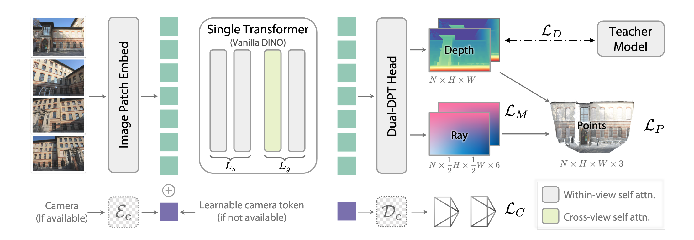
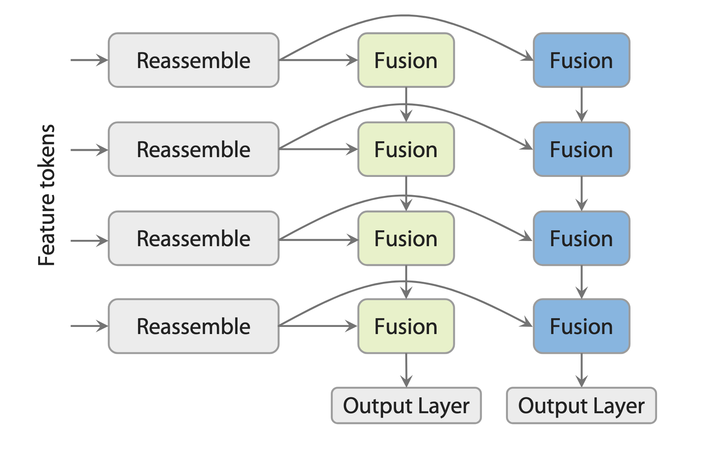

# Depth Anything 3: Recovering the Visual Space from Any Views

arXiv：[2511.10647](https://arxiv.org/abs/2511.10647)；项目页：[Depth Anything 3](https://depth-anything-3.github.io/)；代码：[ByteDance-Seed/Depth-Anything-3](https://github.com/ByteDance-Seed/Depth-Anything-3)

论文：[Lin 等 - 2025 - Depth Anything 3 Recovering the Visual Space from Any Views.pdf](/Users/pro/Desktop/🤖.ai/暑期论文阅读/key_baseline/Lin%20等%20-%202025%20-%20Depth%20Anything%203%20Recovering%20the%20Visual%20Space%20from%20Any%20Views.pdf)

## 开始前复习一下知识点

### 1. 针孔相机、FOV 与坐标系

对第 $i$ 张图像，论文将相机写为：

$$
v_i=(t_i,q_i,f_i)\in\mathbb R^9,
\qquad
t_i\in\mathbb R^3,\quad q_i\in\mathbb R^4,\quad f_i\in\mathbb R^2.
$$

- $t_i$ 是相机中心在世界坐标系中的位置，即平移；
- $q_i$ 是旋转四元数。它用四个数表示三维旋转，实际使用时通常归一化；$q$ 与 $-q$ 表示同一旋转；
- $f_i$ 是两个 FOV 参数，即两个方向上的视场角。论文只说明其属于 $\mathbb R^2$；官方实现采用 $(\mathrm{fov}_h,\mathrm{fov}_w)$，依次为竖直和水平 FOV，单位通常为弧度；
- $K_i$ 是内参矩阵，描述像素位置如何对应到相机的一条视线；
- $(R_i,t_i)$ 是外参。本文公式采用从相机坐标变到世界坐标的约定：

$$
P_{\mathrm{world}}=R_iP_{\mathrm{camera}}+t_i.
$$

FOV 可以直观理解为“相机张开得有多宽”。若图像宽高为 $W,H$，并假设主点在中心、像素为正方形，则：

$$
f_x=\frac{W}{2\tan(\mathrm{fov}_w/2)},
\qquad
f_y=\frac{H}{2\tan(\mathrm{fov}_h/2)}.
$$

FOV 越大，焦距 $f_x,f_y$ 越小，边缘像素的射线越发散。读别的论文时要先确认外参方向：有些工作使用的是反向的 world-to-camera 约定。

### 2. depth-ray 表示为何能恢复三维点

像素 $p=(u,v,1)^\top$ 对应的三维点可写为：

$$
P=R_i\bigl(D_i(u,v)K_i^{-1}p\bigr)+t_i.
$$

DA3 不直接把相机姿态作为主要几何预测目标，而是对每个像素预测一条射线：

$$
r=(t,d)\in\mathbb R^6,
\qquad
d=RK^{-1}p,
\qquad
P(u,v)=t+D(u,v)d.
$$

其中 depth 决定“沿当前视线取多远”，ray 决定“从哪里、朝哪个方向取”。整张 ray map 为：

$$
M\in\mathbb R^{H\times W\times6},
$$

前三个通道存射线原点 $t$，后三个通道存方向 $d$。同一张图的 $t$ 理想上应在所有像素相同；网络逐像素预测它，是为了让 ray 与 depth 都成为图像对齐的稠密输出。

论文特意不把 $d$ 归一化为单位向量。因此 $D$ 不应机械理解成“沿单位射线走了 $D$ 米”，而应理解为和未归一化方向 $d$ 配套的深度系数；二者相乘后才给出正确的三维位置。点云是 depth 与 ray 逐像素组合后的结果，而不是另一个必须直接预测的主目标。

### 3. 旋转矩阵的正交约束

合法的三维旋转矩阵满足：

$$
R^\top R=I,
\qquad
\det(R)=+1.
$$

第一式表示 $R$ 的三列向量长度都为 $1$，且两两垂直；它保证旋转保持长度、角度和体积。第二式排除镜像反射。虽然 $R$ 有 $9$ 个元素，但合法旋转实际只有 $3$ 个自由度；直接独立回归九个数，很容易输出带缩放、剪切或反射的无效矩阵。

DA3 改为预测稠密 ray map，直接给出三维重建需要的 $(t,d)$，而不是要求主预测头先落在严格受约束的旋转矩阵集合中。这不代表任意 ray field 都自动对应一台完美针孔相机，但它提供了更稠密、直接服务于重建的监督目标。

### 4. local camera space、world space 与坐标规范歧义

**local camera space** 指“以当前图像对应相机为原点、以该相机朝向为坐标轴”的局部三维坐标系，并不是图像中的一个小区域。对第 $i$ 个视图中的局部三维点或高斯中心 $\mu_{\mathrm{cam}}$，有：

$$
\mu_{\mathrm{world}}=R_i\mu_{\mathrm{cam}}+t_i.
$$

无 pose 输入时，世界坐标没有天然的原点与朝向：把整个场景和所有相机一起平移或旋转，图像观测并不会改变。这种“坐标名称可以任意选择”的自由度称为 **gauge ambiguity（坐标规范歧义）**。

因此，若一开始要求网络直接预测共享的 world-space 高斯，所有视图必须在缺少显式 pose 的情况下先选中同一个任意全局坐标系。先在各自相机坐标系预测局部几何，再用已知或预测 pose 统一到 world space，会更自然也更稳定。

## Introduction

### 1. 研究背景

从图像恢复三维空间结构，是机器人、AR/VR、混合现实、导航与新视角合成的共同基础。传统计算机视觉通常将这一能力拆成若干相邻但独立的任务：

- **单目深度估计**：从一张图判断各像素的远近；
- **SfM（Structure from Motion）**：从多张重叠图像同时估计相机运动与稀疏三维点；
- **MVS（Multi-View Stereo）**：在已知或估计相机的基础上恢复稠密深度；
- **SLAM（Simultaneous Localization and Mapping）**：在连续视频中一边定位相机、一边构建地图。

这些任务在输入数量、是否已知相机 pose、输出密度上有所不同，但它们共享同一个更基础的问题：**如何从视觉观测中恢复空间几何和相机关系。** 例如，同一模型面对 $N_v=1$ 时应能做单目深度；面对 $N_v>1$ 时则应能利用跨视图对应恢复一致的几何与相机运动。

DA3 因此将目标表述为从任意数量、可有可无相机 pose 的图像中恢复 **visual space**，而非分别为每个传统任务训练一套模型。它希望得到的不是彼此独立的深度图，而是能够放进同一个三维空间的、跨视图一致的几何。

### 2. 现有方法的核心问题

论文认为，现有路线主要面临三类问题。

1. **任务割裂。** 单目深度、相机姿态、点云和新视角渲染常被当作独立问题，导致模型和训练流程彼此分离。它们虽然解决局部子问题，却难以自然覆盖单图、多图、视频以及有 pose / 无 pose 的不同输入条件。
2. **统一模型往往过于复杂。** 一些端到端多视图方法为追求多种输出，使用多阶段、定制化 backbone，或同时预测 point map、pose、局部 / 全局点图等大量目标。额外目标有时能提高单项指标，但也可能引入冗余和耦合，使训练、扩展与迁移更困难；从头联合训练还不容易充分复用大规模预训练视觉模型。
3. **真实监督不够干净。** 真实数据中的 COLMAP、LiDAR 或传感器深度常是稀疏、带噪或边界不完整的。若直接把它们当作稠密真值，模型容易学到粗糙几何，难以同时获得细节与跨域泛化。

这些问题共同指向一个设计问题：能否用一个尽量简单、可继承预训练能力的 backbone，以及一组既不冗余又足以表达几何的预测目标，统一处理不同视图数量和不同相机条件？

### 3. 论文的主要贡献

1. **depth-ray 最小几何表示。** 对每个像素联合预测 depth 与 ray map：

   $$
   P(u,v)=t+D(u,v)d.
   $$

   depth 给出位置沿视线的深度系数，ray 给出相机中心与方向；二者即可恢复点云并隐式表达相机几何。论文的消融显示，该组合比堆叠 point cloud 与 camera 等冗余目标更有效。
2. **plain Transformer 的任意视图架构。** 直接以预训练 DINOv2 为 backbone，通过 token 重排在部分层启用跨视图 attention；前期先建立单图表征，后期交替做跨视图和视图内推理。再结合 camera token，同一网络可以接收 posed 与 unposed 输入。
3. **兼顾关联与专属解码的 Dual-DPT。** depth 与 ray 共用 reassembly 特征，却拥有不同的 fusion / output layers，在几何对齐、任务专属解码和计算冗余之间取得平衡。
4. **Teacher-Student 标签构造。** 用合成数据训练相对深度 Teacher，以 ROE global-local loss 学习细结构；再用 RANSAC scale-shift 将稠密相对深度校准到真实数据的稀疏 metric depth，为 DA3 生成细致且尺度一致的监督。
5. **验证几何 backbone 的可迁移性。** 论文建立 visual geometry benchmark，并将 DA3 微调为 pose-adaptive feed-forward 3DGS，验证更强的几何恢复可以服务位姿、点云、单目深度和新视角合成。

论文的边界也应保留：它证明的是在其训练数据、对齐协议和 benchmark 下，这套精简设计具有很强的统一能力；并不意味着所有场景、尤其是动态或极端退化场景，都可以无条件由单一模型替代传统几何系统。

## Method

### 1. 总体流程与最终输出

> 任意数量 RGB 图像，可选相机 pose  
> $\downarrow$  
> DINOv2 patch tokens + 每视图 camera token  
> $\downarrow$  
> 先视图内、后交替的跨视图 / 视图内 attention  
> $\downarrow$  
> Dual-DPT head  
> $\downarrow$  
> depth map $\hat D$、ray map $\hat M$、可选 camera pose $\hat c$  
> $\downarrow$  
> $\hat P=\hat t+\hat D\hat d$，得到一致点云或下游 3DGS

这里的 token 是 Transformer 使用的一段固定长度特征向量。patch token 对应图像的一块小区域；camera token 则携带或占位表示该视图的相机信息。

### 2. 从 ray map 恢复相机

ray map 的原点通道可以直接平均，得到相机中心：

$$
t_c=\frac1{HW}\sum_{h=1}^{H}\sum_{w=1}^{W}M(h,w,:3).
$$

为从方向场恢复内外参，论文将“标准相机”中的射线 $p$ 与目标相机坐标中的方向建立关系：

$$
d_{\mathrm{cam}}=KRp=Hp,
\qquad
H=KR.
$$

先用 DLT（Direct Linear Transform，直接线性变换）从多条射线拟合单应矩阵 $H$；再用 RQ decomposition（RQ 分解）把它拆成上三角的内参矩阵 $K$ 和正交的旋转矩阵 $R$。这条路径准确但推理时有额外计算，因此论文还增加了一个只读取每视图一个 camera token 的轻量 camera head。

### 3. 单 Transformer：先局部、后全局

ViT 一共有 $L=L_s+L_g$ 层：

- 前 $L_s$ 层只在每张**图像内部进行 self-attention**；
- 后 $L_g$ 层在**跨视图 attention 与视图内 attention 之间交替**；
- 默认取 $L_s:L_g=2:1$。

所谓 self-attention，是让 token 根据内容从其他 token 读取信息。视图内 attention 帮助模型先形成“这张图中有哪些物体、边界在哪里、哪些区域相关”的单图表征；cross-view attention 才在不同图像之间寻找同一物理区域的对应关系并建立几何一致性。

跨视图推理不需要新造一种 Transformer block。作者通过重新排列 token 的维度，让同一 attention 层有时按“每张图一个序列”工作，有时按“所有视图联合序列”工作。单图输入时，跨视图部分自然退化为单目处理，几乎没有额外成本。

这个“先局部、后全局”并非论文直接宣称的稳定训练技巧，而是架构归纳偏置。消融的直接证据是：从第一层起全部交替 cross-view / within-view 的 Full Alt. 方案在几乎所有指标下降；部分交替在准确率与效率之间更好。实际被论文明确称为 stabilizes training 的策略出现在后文的 3DGS 微调中。

### 4. pose-adaptive camera token

论文为每个视图加入一个 camera token：

$$
c_i=E_c(f_i,q_i,t_i).
$$

- 若给定 $(K_i,R_i,t_i)$，轻量 MLP 将 FOV、四元数旋转和位移编码为 $c_i$；
- 若没有相机信息，则使用可学习占位 token $c_l$。

两种 token 的 embedding 维度相同，能进入同一个 token 槽位并经过同一套 attention 权重。已知 pose 时，它提供显式的几何条件；未知 pose 时，它告诉模型该条件缺失，网络转而依赖图像内容和跨视图关系推断几何。因而不需要分别训练“有 pose”与“无 pose”两套 backbone。

论文概念上将 token 描述为拼接到 patch token 前。当前官方实现更具体：它将每视图的 CLS 槽位替换为 camera token；无 pose 时使用一枚 reference-view token 和一枚供所有 source view 共用的 token。这是实现细节，不改变“相同接口、不同条件内容”的设计要点。

### 5. Dual-DPT：共享几何表征，分开任务解码

Dual-DPT 的结构分成三段：

1. depth branch 与 ray branch 共用 reassembly modules；
2. 二者使用不同的 fusion layers；
3. 最后各自使用 output layer 预测 depth 或 ray。

reassembly 的作用是把不同 Transformer 层、不同空间尺度的 token 特征整理成适合像素级预测的特征图；fusion 再将这些多尺度特征融合。

#### Fusion 架构的基础论文谱系

这里的 Fusion 不是由单篇论文突然发明的。它解决的始终是同一个矛盾：**粗尺度特征有更强的全局语义，细尺度特征有更准确的位置与边界；稠密预测需要两者兼得。**

- [[basic paper/FCN|FCN（2015）]]：早期现代 skip fusion 范例；将深层粗语义与浅层得分图相加；
- [[basic paper/U-Net|U-Net（2015）]]：建立经典编码器—解码器与同尺度特征拼接的心智模型；
- [[basic paper/RefineNet|RefineNet（2017）]]：用残差式多路径从粗到细细化表示，是 DA3 Fusion block 最接近的命名技术祖先；
- [[basic paper/FPN|FPN（2017）]]：将“自顶向下路径 + 横向连接”的特征金字塔带成通用范式；DA3 的粗到细数据流与它相似；
- [[basic paper/DPT|DPT（2021）]]：把 ViT token Reassemble 为多尺度二维特征，并以 RefineNet-based Fusion 解码；这是 Dual-DPT 的直接前身。

因此，更准确的技术关系是：

$$
\text{RefineNet}
\rightarrow
\text{DPT}
\rightarrow
\text{DA3 Dual-DPT},
$$

而 FCN、U-Net 与 FPN 提供了这条路线所依赖的早期或并行设计思想。尤其不要把 FPN、RefineNet 写成严格的前后继关系：它们是 2016—2017 年间面向不同任务发展的两条相关路线。

#### 通道压缩为何可行：保留任务相关信息，而非保证无损

Reassemble 后的不同尺度特征，通道数仍可能不同。进入 Fusion 前，网络会用可学习卷积将它们适配到统一的 feature width。对某个空间位置，可以将该过程抽象为：

$$
x\in\mathbb R^{C_k}
\quad\longmapsto\quad
a=W_kx+b_k\in\mathbb R^F.
$$

其中 $C_k$ 是第 $k$ 个尺度原有的通道数，$F$ 是统一后的通道数。若 $F<C_k$，这是一次降维，**不可能保证完整保留原始特征的全部信息**：只知道 $a$ 时，通常无法唯一恢复 $x$。

它之所以仍然可行，依赖一个重要的模型设计直觉：**高维神经网络特征中的许多通道并不是彼此独立的信息源，而往往高度相关、部分冗余。** 例如，多个通道可能共同响应同一条边缘、同一个表面，或同一种跨视图对应模式。换言之，表面上有 $C_k$ 个数，并不意味着存在 $C_k$ 份同等重要且互不相关的信息。

因此，通道压缩不等于“保留前 $F$ 个通道、丢掉其余通道”，而是学习新的组合：

$$
a_j=\sum_{m=1}^{C_k}W_{k,jm}x_m+b_{k,j}.
$$

每个统一后的通道都可以综合许多原通道的信息。若输入特征在真实数据上主要分布在较低维的结构附近，或大量变化对 depth / ray 预测并不重要，那么较小的 $F$ 仍可能保留绝大多数**任务相关**几何信息。

什么该保留由训练目标决定,也就是说，**哪些特征最终应该得到保留由模型学习得到**。深度、ray 和 point-map 损失的梯度会反向更新 $W_k$：若压缩后丢失了辨别遮挡边界、表面深度或相机方向所必需的线索，预测误差会增大，训练便会推动投影层把这类线索重新编码进统一通道。多尺度分支也提供了互补证据，因此某个尺度不必独自保存整张图的所有细节。

> 这里应说“有效的任务相关压缩”，而不是“无损压缩”。feature width 是表达能力、计算量与显存之间的折中；若压得过窄，重要几何线索仍可能丢失，最终表现会下降。

完全分离会重复构建中间表示，也削弱 depth 与 ray 的几何对齐；完全共享到最后则会迫使“每像素一个标量深度”和“每像素一个六维射线”使用同一种读出方式，容易产生任务竞争。Dual-DPT 的折中是：共享前段的视觉几何上下文，分开后段的任务专属融合与输出。

### 6. 主模型的几何训练目标

主模型输出：

$$
F_\theta(\mathcal I)\mapsto\{\hat D,\hat M,\hat c\}.
$$

论文先将所有真值信号按有效 point map 的平均 $\ell_2$ 范数做共同尺度归一化，再计算：

$$
\mathcal L=
\mathcal L_D(\hat D,D)
+\mathcal L_M(\hat M,M)
+\mathcal L_P(\hat t+\hat D\odot\hat d,P)
+\beta\mathcal L_C(\hat c,v)
+\alpha\mathcal L_{\mathrm{grad}}(\hat D,D).
$$

其中：

- $\mathcal L_D$ 监督深度，并结合 depth confidence；
- $\mathcal L_M$ 监督 ray map；
- $\mathcal L_P$ 监督由两者解析组成的 point map，迫使两个 head 在同一三维几何上协调；
- $\mathcal L_C$ 是可选的 camera pose 损失；
- $\mathcal L_{\mathrm{grad}}$ 比较深度梯度：

$$
\mathcal L_{\mathrm{grad}}
=\lVert\nabla_x\hat D-\nabla_xD\rVert_1
+\lVert\nabla_y\hat D-\nabla_yD\rVert_1.
$$

梯度损失保护物体边界，同时约束平面区域不要出现不必要的起伏。共同尺度归一化与 point-map 项分别解决“不同模态量级不一致”和“depth、ray 各自正确但组合后不一致”的问题。

## Teacher-Student Learning

### 1. 为什么需要 Teacher

真实世界多视图数据常只有 COLMAP、LiDAR 或主动传感器产生的深度。这些深度往往稀疏、带噪、边界不完整，直接监督会限制模型细节。DA3 因此先在大规模合成数据上训练一个单目相对深度 Teacher，再让它为真实数据补出稠密、细致的 pseudo-depth。

Teacher 的几个关键变化是：

- 输出 scale-shift-invariant **depth**，而非 DA2 的 disparity。depth 更直接服务于多视图几何和 metric depth；
- 预测 exponential depth，以增强近处区域的区分能力；
- 训练数据扩展到室内、室外、物体和 in-the-wild 合成场景；
- 加入距离加权 surface-normal loss，并同时预测 sky mask 与 object mask，避免无定义区域污染深度监督。

### 2. ROE global-local loss：训练 Teacher 时忽略不重要的尺度自由度

ROE 是 **Robust, Optimal, Efficient** alignment，来自 MoGe 的 global-local loss。它用于 Teacher 的训练阶段，比较的是 Teacher 的预测几何与合成数据的可信真值。

相对深度的整体 scale 和 shift 本身可能不确定。若预测场景形状完全正确、只是整体更大或更远，直接逐点比较会把“坐标标尺不同”误罚成几何错误。ROE 先求预测与真值之间最合适的 scale-shift 对齐，再把剩余误差作为形状误差。

- **global** 对整张图或整片点图做一次对齐，关注房间布局、物体远近等大尺度结构；
- **local** 在多个局部三维邻域内独立对齐，关注台阶、轮廓、表面起伏等细节；
- **robust** 通过稳健残差抑制离群点，避免少量错深度像素主导损失。

它的作用可以概括为：**先把坐标标尺差对齐掉，再训练 Teacher 学正确的形状。**

### 3. RANSAC scale-shift：把 Teacher 的相对深度校准成真实监督

Teacher 训练好之后，会输出稠密但相对的深度 $\tilde D$。对真实图像，论文将它和已有的稀疏、带噪 metric depth $D$ 对齐：

$$
(\hat s,\hat t)
=\arg\min_{s>0,t}
\sum_{p\in\Omega}
m_p\bigl(s\tilde D_p+t-D_p\bigr)^2,
\qquad
D_{T\to M}=\hat s\tilde D+\hat t.
$$

$m_p$ 是有效深度点的 mask。RANSAC（Random Sample Consensus，随机采样一致性）会反复用少量点估计候选 $(s,t)$，再选择拥有最多一致内点的解，从而降低 COLMAP 或传感器离群值的影响。

| | ROE global-local loss | RANSAC scale-shift |
|---|---|---|
| 所在阶段 | 训练 Teacher 时 | Teacher 生成真实数据伪标签时 |
| 输入 | Teacher 预测几何 + 合成真值 | 稠密相对深度 + 稀疏或带噪 metric depth |
| 输出 | 一个训练损失 | $\hat s,\hat t$ 与尺度一致的稠密伪标签 |
| 核心目的 | 对齐掉尺度、偏移等无关自由度，学习形状 | 从真实测量中取回尺度，构造可用监督 |

> 记忆句：ROE 是“对齐掉尺度差，再学形状”；RANSAC 是“从真实测量取回尺度，再造标签”。

### 4. Teacher 的完整损失

Teacher 同时使用深度梯度、ROE global-local、距离加权法线、天空 mask 和物体 mask 损失：

$$
\mathcal L_T
=\alpha\mathcal L_{\mathrm{grad}}
+\mathcal L_{\mathrm{gl}}
+\mathcal L_N
+\mathcal L_{\mathrm{sky}}
+\mathcal L_{\mathrm{obj}},
\qquad
\alpha=0.5.
$$

法线损失将相邻像素反投影为三维点，从局部三角形计算表面法线；距离中心更远的邻居权重更小。这样既要求表面方向正确，也降低远邻像素跨越深度边界时对局部几何的干扰。

## Application: Feed-Forward 3D Gaussian Splatting

### 1. GS-DPT 与高斯参数

在 DA3 backbone 上新增 GS-DPT head 后，模型可对每个像素预测一个 3D Gaussian 的属性：

$$
\{\sigma_i,q_i,s_i,c_i\}.
$$

- $\sigma_i$：不透明度；
- $q_i$：高斯椭球的旋转四元数；
- $s_i\in\mathbb R^3$：三个轴上的尺度；
- $c_i$：颜色。pose-adaptive 版本中用 spherical harmonic 系数替代单个 RGB，以表达随观察方向变化的外观。

深度反投影提供高斯中心。训练时，论文同时使用新视角渲染的 photometric loss，例如 MSE、LPIPS，以及观测视图深度的 scale-shift-invariant loss。

### 2. pose-adaptive 3DGS

pose-adaptive 版本的关键不是在无 pose 情况下凭空拥有绝对世界坐标，而是：

1. 所有 3DGS 参数先在 local camera space 预测；
2. 复用已经能够处理 posed 与 unposed 输入的 DA3 backbone；
3. 有已知 pose 时，用已知 pose 将局部深度与高斯变到 world space；无 pose 时，改用 DA3 预测的 pose。

为缓和“几何表面要准确”与“渲染外观要好看”之间的冲突，GS-DPT 额外预测 depth offset。它让几何主干维持稳定，同时留出小的自由度优化渲染质量。

### 3. 本次阅读必须记住的稳定训练策略

> 训练 3DGS 时，以预训练 DA3 权重初始化 backbone，并冻结 backbone；只训练新增的 GS-DPT head。

此外，训练时同时改变图像分辨率和 context view 数：

- 高分辨率输入 $\rightarrow$ 更少 context views；
- 低分辨率输入 $\rightarrow$ 更多 context views。

论文明确指出，这种分辨率-视图数配对能够稳定训练，并使模型适应不同分辨率、不同输入视图数的实际评测场景。这里的稳定并非来自 attention 先局部后全局，而是来自冻结成熟几何 backbone，并让每个 batch 的计算与上下文复杂度更可控。

## Experiments

### 1. Visual Geometry Benchmark：评什么

论文新建 benchmark，覆盖 HiRoom、ETH3D、DTU、7Scenes 与 ScanNet++ 共 89 个以上场景，评价三件事：

1. **Pose accuracy**：通过 AUC@3 与 AUC@30 衡量相对旋转和相对平移的角度准确性。阈值越小，要求越严格；
2. **Geometry accuracy**：将预测 pose 与 depth 融合为点云，和真值点云比较 Chamfer Distance、F1 等指标；
3. **Visual rendering**：以 PSNR、SSIM、LPIPS 评价新视角合成。

几何评测中，预测重建会先和真值 pose 做对齐，再融合深度。因此需要注意：该协议主要评价相对几何和相对位姿是否一致，不等价于无外部坐标对齐时的绝对米制精度。

### 2. 主要证据

- 论文报告 DA3 在该 benchmark 的 20 个主要设置中取得 18 个最佳结果，并在相机姿态、几何重建与渲染上整体优于 VGGT；
- 单目任务中，Teacher 在标准深度 benchmark 上优于 DA2；用 Teacher 伪标签训练的单目 student 也取得强泛化结果；
- 以 DA3 为 backbone、仅增加 GS-DPT 的 feed-forward 3DGS 在文中 NVS benchmark 中表现强，支持“更强的几何基础能力有助于新视角渲染”的主张。

这些结果支持的是整体折中与所测任务上的优势，不应扩展为“任何数据分布、任何动态场景下都全面优于所有模型”。

### 3. 决定性消融

1. **depth-ray 目标足够。** Table 6 中，depth + ray 一致优于 depth + point cloud + camera 和 depth + camera；额外 camera head 基本不提高核心几何表现，说明它主要提供更快的实用 pose 输出，而不是几何能力的来源。
2. **部分跨视图交替优于从第一层全部交替。** Full Alt. 在几乎所有指标退化，支持先保持单图特征、再引入跨视图推理的设计。
3. **Dual-DPT 优于两个完全独立的 DPT head。** 共享 reassembly 既减少中间表示冗余，也提高 depth-ray 输出的一致性。
4. **Teacher 标签有价值。** 去掉 Teacher 监督会损失细结构和跨域泛化，论文可视化显示 Teacher 标签比原始现实深度更完整、更清晰。
5. **pose conditioning 是可选增强。** 已知 pose 时，camera token 能让网络利用外部几何条件；没有 pose 时，同一 backbone 仍可从图像和跨视图线索工作。

### 4. 成本、边界与待验证点

1. **训练成本高。** DA3-Giant 的训练约使用 $128$ 张 H100、持续约 $10$ 天；plain transformer 指的是架构简洁，不等于训练廉价。
2. **动态场景没有显式建模。** 运动物体、遮挡变化和非刚体形变会破坏静态多视图对应，论文未将其作为主要解决对象。
3. **从 ray map 恢复相机有开销。** DLT + RQ 可从 ray 中恢复几何一致的相机，但轻量 camera head 的存在说明实际应用仍需要更快的替代路径。
4. **伪标签校准依赖稀疏 metric depth 的质量。** RANSAC 能压制离群值，但若有效点极少或集中于一小块区域，$(s,t)$ 的可靠性仍值得单独检查。
5. **NVS 的 posed 与 unposed 证据要分开看。** benchmark 常用已知 COLMAP pose 保证公平渲染比较；这不等于已经完全验证 pose-free NVS 中相机误差对渲染的影响。

## Conclusion

DA3 的核心不是简单地“同时预测更多东西”，而是用一个足够完整又尽量不冗余的几何接口，把任意视图输入、相机推断和下游三维任务接起来：

> 任意数量、可有可无 pose 的图像  
> $\downarrow$  
> 预训练 plain ViT 先建单图表征，再进行跨视图推理  
> $\downarrow$  
> Dual-DPT 联合预测 depth 与 ray  
> $\downarrow$  
> $P=t+Dd$ 恢复一致 point cloud，并可恢复或快速预测 camera pose  
> $\downarrow$  
> 作为 geometry foundation backbone 服务 metric depth、单目深度与 pose-adaptive 3DGS

最值得迁移到其他工作中的想法有三点：

1. **表示选择优先于输出数量。** 若两个输出可以通过明确几何关系组合，就应优先监督这种组合关系，而不是盲目增加冗余 head；
2. **统一接口优先于分裂模型。** camera token 用同一 embedding 槽位表达“有显式几何条件”和“条件缺失”，使同一 backbone 覆盖 posed / unposed 数据；
3. **伪标签不是简单替代真值。** Teacher 先学习细结构，RANSAC 再把真实稀疏测量中的尺度注入它；两者分工后，才得到同时细致且几何一致的监督。
