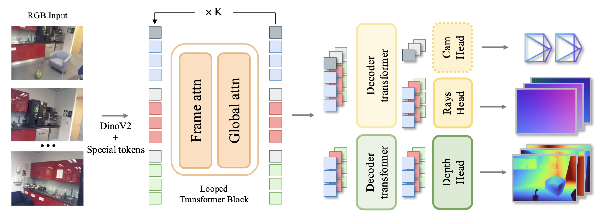

# Déjà View: Looping Transformers for Multi-View 3D Reconstruction

arXiv：[2605.30215](https://arxiv.org/abs/2605.30215)；项目页：[DéjàView](https://research.nvidia.com/labs/dvl/projects/dvlt/)；代码：[nv-tlabs/dvlt](https://github.com/nv-tlabs/dvlt)

论文：[Burzio 等 - 2026 - Déjà View Looping Transformers for Multi-View 3D Reconstruction.pdf](/Users/pro/Desktop/🤖.ai/暑期论文阅读/key_baseline/Burzio%20等%20-%202026%20-%20Déjà%20View%20Looping%20Transformers%20for%20Multi-View%203D%20Reconstruction.pdf)

## 开始前复习一下知识点

### 1. SfM、稠密几何与 depth-ray 表示

经典 Structure-from-Motion（SfM）从多张有重叠视野的图像中，同时求相机位姿与稀疏三维点。其典型流程为：特征匹配、相对位姿估计、三角化、不断注册新图与 Bundle Adjustment。它是一个显式的迭代过程：加入新观测后，旧的相机和三维点也会被反复校正。

现代端到端方法往往不显式执行这些阶段，而是直接从图像预测稠密几何。DéjàView 采用 **depth-ray** 表示。对每张输入图像的每个像素 $(u,v)$，模型预测：

- 深度 $D(u,v)$；
- 射线原点与未归一化方向组成的射线图 $R=(R^o,R^d)\in\mathbb R^6$。

于是该像素对应的世界点为：

$$
X(u,v)=R^o(u,v)+D(u,v)\,R^d(u,v).
$$

depth 是“沿当前像素视线走多远”，ray 则给出“从哪里、朝哪个方向走”。两者相乘后得到点图（pointmap）。相机外参、内参可从全图的 ray map 恢复；论文还训练了一个 camera head，但推理默认使用由 ray map 恢复的相机。

这比只预测每张图各自相机坐标中的深度更一般：当不同视图的 ray 与 depth 都在首帧世界坐标系中一致时，它们自然对应同一个全局三维场景。

### 2. Weight tying 与 looped Transformer

普通深层 Transformer 可抽象为：

$$
z_{l+1}=f_{\theta_l}(z_l),\qquad l=1,\ldots,L,
$$

即每层都有独立参数 $\theta_l$。而 weight tying 把它改成反复调用同一个函数：

$$
z_{k+1}=f_\theta(z_k),\qquad k=1,\ldots,K.
$$

这里 $k$ 不是训练 epoch，而是同一次前向传播里对同一个共享 block 的第 $k$ 次调用。它将“更多深度”改成“更多迭代”：参数量随一个 block 的大小决定，计算量则随 $K$ 增加。

这篇论文的出发点是：多视图 Transformer 的深层并不只是堆积不同的特征提取器。已有对 DUSt3R 的逐层分析显示，pointmap 会随着 decoder 深度逐步变好；因此，层深中部分能力很可能是在隐式地执行“估计—校正—再估计”。DéjàView 将这一隐式迭代改成显式循环，并直接在三维重建损失上端到端训练；它不是先训练大教师网络、再通过 post-hoc distillation 压缩成循环网络。

### 3. 连续时间条件与可变步数 $K$

若共享 block 只知道离散编号“第 1 步、第 2 步”，则它与训练时的固定步数绑定。DéjàView 将 $[0,1]$ 均分为：

$$
0=t_0<t_1<\cdots<t_K=1,\qquad t_k=\frac{k}{K},
$$

并使用：

$$
z_{k+1}=f_\theta(z_k,t_k,t_{k+1}).
$$

因此模型看到的是“本次从时间 $t_k$ 走到 $t_{k+1}$ 的区间”，而不是某个绝对层号。若 $K=8$，每次是较大的 $1/8$ 步；若 $K=16$，每次是较小的 $1/16$ 步。训练时从 $[8,16]$ 中按 $\operatorname{Beta}(2,1)$ 采样 $K$，使一个 checkpoint 可在该范围内以不同计算预算运行。

这不是任意步数都有效的 ODE solver：实验显示超出训练范围很远时性能会退化。它应被理解为“在训练过的预算区间内可调”的循环模型，而非理论上无限可外推的迭代器。

### 4. Pre-norm Attn + MLP、LayerScale 与时间门控

一个标准 pre-norm Transformer 子块先归一化、再计算分支、最后通过残差加回：

$$
x' = x+\operatorname{Attn}(\operatorname{LN}(x)),
\qquad
x'' = x'+\operatorname{MLP}(\operatorname{LN}(x')).
$$

其中 Attention 在 token 间交换信息，MLP 对每个 token 的通道做非线性变换；“pre-norm”表示 LayerNorm 位于分支输入而非残差相加之后。残差通路保留旧状态，使 block 只需学习本轮应写入的更新。

DéjàView 在此基础上使用 LayerScale，并按时间区间产生三组**逐通道向量**：

$$
\begin{aligned}
z' &= z_k+\mathbf s_{\mathrm{attn}}\odot
\operatorname{LS}_1\bigl(\operatorname{Attn}(\operatorname{LN}_1(z_k))\bigr),\\
z'' &= z'+\mathbf s_{\mathrm{mlp}}\odot
\operatorname{LS}_2\bigl(\operatorname{MLP}(\operatorname{LN}_2(z'))\bigr),\\
z_{k+1} &= \mathbf s_{\mathrm{out}}\odot z''.
\end{aligned}
$$

三者不是 RGB 等“三个通道”，而是三个长度等于 feature dimension 的缩放向量，且在 token 序列维度上广播：

- $\mathbf s_{\mathrm{attn}}$ 控制跨 token、跨视图信息写入 residual stream 的强度；
- $\mathbf s_{\mathrm{mlp}}$ 控制逐 token 非线性变换的强度；
- $\mathbf s_{\mathrm{out}}$ 控制整个更新后状态进入下一轮时的逐通道尺度。

这些缩放由零初始化 MLP 产生：

$$
\mathbf s=1+\operatorname{MLP}(\gamma(t_k,t_{k+1})),
$$

其中 $\gamma$ 拼接两个端点的 sinusoidal embedding。零初始化使训练开始时 $\mathbf s\approx1$，模型退化为稳定的普通残差 block；之后才学习早期大步修正、后期细化时不同分支应有的更新强度。

## Introduction

### 1. 问题：大模型的深度的底层究竟是什么？

多视图三维重建已从传统 SfM 的显式优化，转向一次前向预测几何的 DUSt3R、MASt3R、VGGT、Pi3、Depth Anything 3 等模型。它们的性能提升常伴随数亿到十亿级参数、越来越深且越来越宽的 Transformer。

面对这种情况，作者提出一个不同的解释：深度 Transformer 中连续的层可能在反复执行相似的几何细化操作，因而部分参数是为“迭代次数”付费，而不一定是为必须独立的表达能力付费。若该判断成立，适合的架构应是**让一个容量较小但具备跨视图推理能力的 block 多次复用**，而不是继续堆叠参数不共享的层。

### 2. 与现有迭代方法的区别

RAFT 一类方法通常在一个预先计算的 correspondence volume 或特征骨干上，用轻量 recurrent updater 反复直接修正任务空间输出，例如 optical flow。训练常在每一步 decode 并施加 sequence loss。

DéjàView 的循环位于**内部 token 状态**：

> 多视图图像  
> $\downarrow$  
> 共享 DINOv2：每视图 patch token + special tokens  
> $\downarrow$  
> 同一个 frame-attention + global-attention block 循环 $K$ 次  
> $\downarrow$  
> 仅将最终 $z_K$ 交给 ray / depth decoder  
> $\downarrow$  
> ray map、depth、pointmap 与相机位姿

这样避免了每个中间步都运行 decoder 与计算 loss；一次训练迭代比逐步监督少 $(K-1)$ 次 decoder 的前向和反向传播。与 iLRM 的无共享层、且对独立 scene representation 优化不同，DéjàView 每一步都在同一批 per-view tokens 内同时做跨视图推理与更新。

### 3. 论文的主要贡献

1. 提出以一个共享 Transformer block 循环更新 DINOv2 多视图 token 的三维重建器；每一轮以连续时间区间为条件。
2. 用 variable-$K$ 训练使单一 checkpoint 覆盖多个推理计算预算，而不需为每个 $K$ 单独训练。
3. 在室内、室外、物体和驾驶场景的五个 benchmark 上，用 117M 参数获得与大得多的前馈方法相当或更好的平均几何和位姿结果。
4. 通过残差流分析提出 **directional refinement**：状态范数不收敛，但状态方向逐渐朝最终状态对齐，解码结果因 pre-norm 而有效收敛。

## Method

### 1. Problem formulation

给定同一静态场景的 $V$ 张 RGB 图像：

$$
\mathcal I=\{I_i\}_{i=1}^{V},\qquad I_i\in\mathbb R^{H\times W\times3},
$$

输入中**不提供**相机内参、外参或预先计算的图像匹配。目标是从这组无位姿多视图图像中恢复：

$$
\mathcal G=\Bigl(\{D_i,R_i\}_{i=1}^{V},\ \{R_i^{\mathrm{cam}},t_i,K_i\}_{i=1}^{V}\Bigr),
$$

其中 $D_i\in\mathbb R^{H\times W}$ 是第 $i$ 张图的稠密深度图，$R_i\in\mathbb R^{H\times W\times6}$ 是稠密 ray map；$R_i^{\mathrm{cam}}\in SO(3)$、$t_i\in\mathbb R^3$、$K_i\in\mathbb R^{3\times3}$ 分别是该视图相对于全局坐标系的旋转、平移和内参。论文将全局三维几何表达在**第一张参考图像的坐标系**中，因此首帧提供了规范坐标系，而不是已知的真实世界尺度或外部坐标。

换言之，模型要同时解决两件事：

1. 跨图找到同一物理区域的对应关系;
2. 并将每张图的像素几何放进一致的三维坐标系。

这是无位姿多视图重建，而非“给定相机位姿后的多视图深度估计”。

### 2. Depth-ray 表示、坐标系与输出

对每张输入图像的每个像素，最终输出 depth map $D_i$ 与 6D ray map $R_i$。将 ray map 拆为原点和未归一化方向：

$$
R_i=(R_i^o,R_i^d),\qquad R_i^o,R_i^d\in\mathbb R^3,
$$

则每像素的预测世界点为：

$$
X_\theta=R_\theta^o+D_\theta\cdot R_\theta^d.
$$

这个联合参数化将深度与射线约束到同一几何关系中：单独预测正确的 depth 或 ray 都不够，二者组合出的 $X_\theta$ 也必须正确。论文默认根据完整 ray map 恢复相机；额外训练的 camera MLP head 是更快的替代方案。

### 3. 从图像到初始状态 $z_0$

共享的 DINOv2 ViT-B 将每张输入图变为 $\frac{H}{P}\times\frac{W}{P}$ 的 patch token 网格；论文设置 patch size $P=14$，encoder feature dimension 为 768。每个视图再加入：

- $R=4$ 个可学习 register token；
- 一个可学习 camera token。

register token 与 camera token 的基础参数在视图间共享。camera token 例外地有两套参数：首个 reference view 使用一套，其他视图共用另一套，以标记首帧坐标系的特殊地位。patch 采用二维 RoPE；special token 分配到 patch 网格外的 sentinel position。

因此 $z_0$ 不是压缩到单个 global latent 的场景码，而是保留各视图、各 patch 的 token。循环 block 会在这些 token 中持续建立对应关系并更新几何解释。

### 4. Looped Transformer Block

每个循环 block 按 VGGT 风格顺序包含两个 attention 子块：

1. **Frame attention**：在每一个视图内部独立计算 attention，并使用二维 RoPE；它侧重单图像内局部结构与上下文。
2. **Global attention**：在所有视图的 joint token sequence 上计算 attention；它使一个 patch 可读取其他视图中的对应证据，从而进行跨视图匹配与几何一致性推理。

这两个子块都使用上一节的 pre-norm Attn + MLP 残差结构、LayerScale 和时间门控。所有 $K$ 次循环共享同一组 Transformer 权重；时间门控则令相同权重可根据当前求解阶段采取不同更新方式。

### 5. Directional refinement：不是 fixed-point convergence

作者在同一条 $K=16$ 推理轨迹中，逐步 decode $z_k$ 并观察：随着 $k$ 增加，Pose AUC@3、Pose AUC@30 单调上升，而 Pointmap Rel. L2 单调下降。这说明循环并非只是在重复计算，任务输出确实逐轮变好。

但特征状态没有收敛到固定向量。设最终状态为 $z_K$，实验发现：

$$
\cos(z_k,z_K)\uparrow1,
\qquad
\frac{\lVert\Delta z_k\rVert}{\lVert z_k\rVert}\downarrow,
\qquad
\lVert z_k\rVert_2\uparrow.
$$

即：更新的相对量逐渐变小，状态**方向**逐渐与终点对齐，但整体范数在后期仍增长。因此它不是深度平衡模型式的 fixed point，也不同于 RAFT 在任务空间让绝对更新收缩的模式。

decoder 的第一个 transformer block 是 pre-norm，起始 LayerNorm 会吸收平行于 $z_k$、主要导致范数增长的分量。于是虽然 raw residual state 幅度继续变化，decoder 所看到的归一化表示在方向上已趋于稳定。这是论文称其为 directional refinement 的关键理由，而不是“特征已经完全不变”。

补充材料的 attention 可视化也提供了行为证据：在第 1 轮，global attention 对另一视图的关注较分散；迭代后会逐渐集中到真实的对应区域，并处理对称物体的多个几何等价对应。模型未直接接受特征匹配监督，这种 correspondence search 是由三维与位姿损失涌现出来的。

### 6. Decoder、相机恢复与两阶段训练

最终 $z_K$ 进入两条并行 decoder branch；每条由浅层 Transformer 与输出 head 组成。decoder transformer 延续 pre-norm Attn + MLP，但不使用 LayerScale：

- **Ray decoder**：用 linear pixel-shuffle head 输出 $R_\theta\in\mathbb R^{H\times W\times6}$；其 camera token 还可进入 MLP，输出平移、单位四元数和水平/垂直 FoV。
- **Depth decoder**：输出 $D_\theta\in\mathbb R^{H\times W}$ 与深度置信图 $c_D$。最终版用 convolutional head，避免线性 pixel-shuffle 在 DINO patch 边界产生方块伪影。

训练对预测与真值 pointmap 分别做尺度归一化。对有效点集合 $\Omega$，逆尺度为：

$$
s=\left(\frac1{|\Omega|}\sum_{j\in\Omega}\lVert X_j\rVert_2\right)^{-1}.
$$

总损失同时包含深度、深度梯度、ray、由 depth-ray 解析得到的 pointmap、以及相机损失：

$$
\mathcal L=
\lVert\hat sD_\theta-\bar sD\rVert_2+
\mathcal L_{\mathrm{grad}}+
\lVert\hat sR_\theta-\bar sR\rVert_1+
\lVert\hat sX_\theta-\bar sX\rVert_2+
\mathcal L_{\mathrm{cam}}.
$$

其中 pointmap 项将两个 head 绑到同一几何约束上。训练分两阶段：

1. 端到端训练全部模块，采用 linear depth head 和普通 $\ell_2$ 深度损失；
2. 替换为卷积 depth head，冻结其他模块，仅微调 depth decoder，并使用 DUSt3R 风格的置信度加权损失。

直接从头端到端训练“卷积 head + confidence loss”反而较差；两阶段先学好全局几何、再修补 patch 边界，是一个实用而非纯架构性的训练选择。

## Experiments

### 1. 实验设置与指标

训练使用 29 个公开数据集的混合，覆盖合成、室内外真实采集、物体扫描与驾驶视频。数据量差异很大，作者按 $p_i\propto\sqrt{N_i}$ 抽样，而不是完全按图像数比例或均匀采样，避免最大数据集垄断训练。

实现使用 DINOv2 ViT-B；训练中每场景输入 $V\in[2,18]$ 张图像、最长边 504 px，每批 token 总数约 2.5M。第一阶段端到端训练 200K iterations；第二阶段深度 decoder 微调 40K iterations。实验资源为 128 张 H100，因此“参数高效”不表示训练成本很低。

评测覆盖 DTU、ETH3D、7-Scenes、ScanNet++、nuScenes。点图在 Sim(3) 对齐后计算：

$$
r_i=\frac{\lVert X_{\theta,i}-X_{\mathrm{gt},i}\rVert}{\lVert X_{\mathrm{gt},i}\rVert}.
$$

- **Rel. L2 $\downarrow$**：有效点 $r_i$ 的均值；
- **IR $\uparrow$**：满足 $r_i<3\%$ 的点比例；
- **Pose AUC@3 / AUC@30 $\uparrow$**：累计位姿误差曲线在 $0^\circ\!\sim\!3^\circ$ / $30^\circ$ 区间下的面积。每对相机的误差取旋转角误差和平移方向角误差的较大者。

因此 AUC@3 衡量非常严格的相机精度，AUC@30 更反映位姿是否在较宽松容差下大体正确；AUC 不是简单的“阈值内样本百分比”。

### 2. 主结果：较少参数下的平均领先

在 24 张输入图像的效率比较中，DéjàView 为 117M 参数、75.9 TFLOPs（3.2 TFLOPs/图）、4.9 GiB 峰值显存；五个 benchmark 平均 IR 为 80.3，平均 AUC@30 为 91.8。相比之下，Pi3 为 959M 参数 / 153.8 TFLOPs，VGGT 为 1257M / 190.0 TFLOPs，DA3-G 为 1201M / 178.7 TFLOPs。

作者的核心证据不是“所有单项均为第一”，而是下列组合：

1. 在五种场景、两类输出（pointmap 与 pose）上保持强竞争力；
2. 平均 IR 与平均 AUC@30 最好；
3. 模型参数约为最接近的大型前馈基线的一个数量级以下，显存也低于 5 GiB。

仍需按数据集阅读，而非只看均值：VGGT 在 DTU 的最严格 AUC@3 上仍优于本方法（96.5 对 83.2）；VGGT-$\Omega$ 在 ETH3D、nuScenes 的 Rel. L2 及部分 7-Scenes pose 指标上有优势；Pi3 在部分室内 pointmap 指标很强。论文更稳妥的结论是“以更低参数获得最佳平均折中”，不是全面取代所有方法。

此外，MASt3R-SfM 的 FLOPs 表中只统计 pair network 的前向，不包含随后的 sparse global alignment；直接将其与端到端一次前向方法比较计算量时需要保留这一口径差异。

### 3. 共享权重和门控的消融

Table 4 在相同训练数据与计算量下比较四种设计，指标为五个 benchmark 的平均值：

| 设计 | Rel. L2 $\downarrow$ | IR $\uparrow$ | AUC@3 $\uparrow$ | AUC@30 $\uparrow$ |
|---|---:|---:|---:|---:|
| Decoupled：16 步各有独立 block | 0.056 | 61.1 | 23.0 | 82.0 |
| Shared：单一共享 block | 0.045 | 66.4 | 30.2 | 84.8 |
| Shared + residual gates | 0.042 | 67.0 | 31.5 | 85.9 |
| Shared + residual gates + state gate | **0.040** | **69.2** | **33.3** | **86.9** |

值得注意的是，共享权重不仅将 16 个 block 压成 1 个、参数量减少 16 倍，还优于参数独立的 decoupled variant。这是论文最直接支持“weight tying 是归纳偏置而不只是压缩”的实验。但它只证明该数据、训练配方和 16 步设定下的优势，不能推出所有视觉 Transformer 都应共享权重。

### 4. Variable-$K$ 的证据与边界

同一个 variable-$K$ checkpoint 在训练时采样 $K\in[8,16]$。结果显示：

| 推理预算 | Fixed-$K$ 训练 | Variable-$K$ 训练 |
|---|---|---|
| $K_{\mathrm{inf}}=12$ | Rel. L2 0.044，IR 67.6，AUC@30 85.5 | Rel. L2 0.043，IR 66.7，AUC@30 85.4 |
| $K_{\mathrm{inf}}=16$ | Rel. L2 0.041，IR 69.6，AUC@30 86.8 | Rel. L2 0.040，IR 69.2，AUC@30 86.9 |

可见 variable-$K$ 在 12 和 16 步内接近对应 fixed-$K$ 模型，代价约为 2%–3% 以内；它提供的是灵活预算，而非固定预算下系统性更高的上限。

补充材料进一步区分两种低于 $K_{\max}$ 的用法：应以目标 $K_{\mathrm{inf}}$ 在 $[0,1]$ 上重新均匀划分时间区间并完整运行，而不是在一个 16 步轨迹中提早读取 $z_k$。在 $K_{\mathrm{inf}}=8$ 时，前者的 Pose AUC@3 从 0.31 升至 0.44，约为 43% 的相对提升，说明连续时间条件并不是装饰，而决定了不同预算下每一步的语义。

### 5. 局限性与阅读判断

1. **不能随意多迭代。** $K_{\mathrm{inf}}$ 超过训练上限后，少量 feature channel 会无界增长；Pose AUC@3 在训练预算附近达到峰值，Pointmap Rel. L2 虽可在更长一段范围保持稳定，最终仍会崩溃。directional refinement 不是无条件稳定的收敛过程。
2. **可变预算不等于更优质量。** variable-$K$ 主要换取一个 checkpoint 适应多个预算；在相同 $K$ 下，其目标是匹配 fixed-$K$，而不是超过它。
3. **未显式处理动态场景。** 训练数据可含驾驶与现实视频，但模型本身没有针对运动物体的时序/动态建模机制。
4. **训练资源依然显著。** 117M 的推理模型是在 128 H100 上训练得到；论文证明的是推理时参数、显存和计算的效率，并非低训练成本。
5. **输出仍是几何重建的中间表示。** pointmap、depth 与 pose 可服务于后续融合、渲染或几何任务，但论文不直接给出 watertight mesh 或完整新视角外观建模。

## Conclusion

DéjàView 的核心不只是“把 Transformer 循环起来”，而是将多视图几何推理改写为一个可控的、时间条件化的状态更新过程：

> 多视图 DINOv2 token  
> $\downarrow$  
> 视图内 attention 保留局部图像结构  
> $\downarrow$  
> 跨视图 global attention 寻找对应与建立几何一致性  
> $\downarrow$  
> 共享 block 在连续时间网格上反复更新内部状态  
> $\downarrow$  
> 最终 decode 为 ray、depth、pointmap 与 pose

它给出的结论是：对于多视图三维重建，增加独立层的收益有一部分可以由显式的、权重共享的迭代获得，而且共享本身可能带来更强的迭代归纳偏置。最值得复用的思想不是盲目增加循环次数，而是同时具备三点：**跨视图推理发生在每一轮更新中、时间条件与步数解耦、训练只监督最终几何但分析中验证每轮确有改善。**
