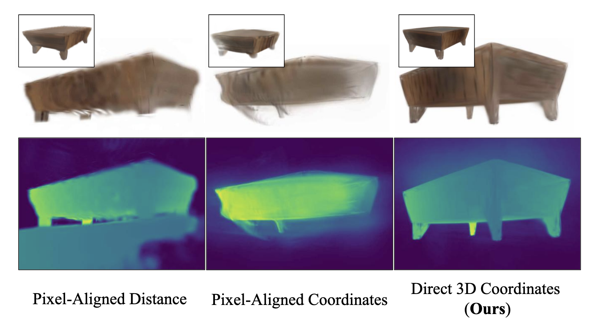
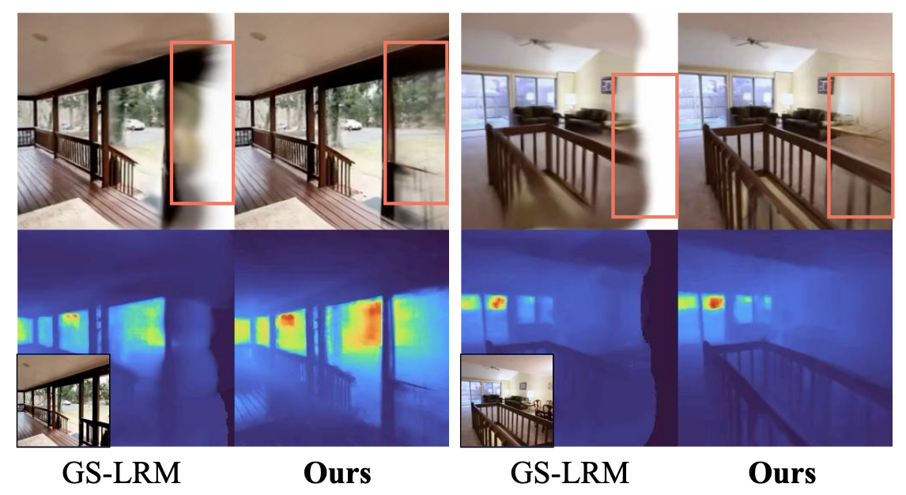
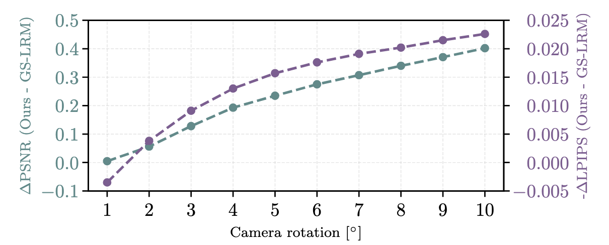
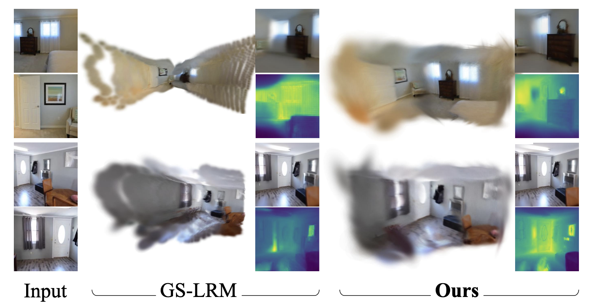
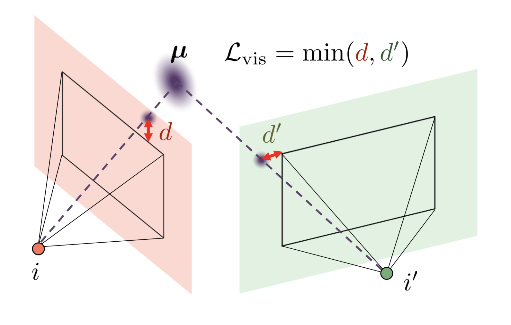
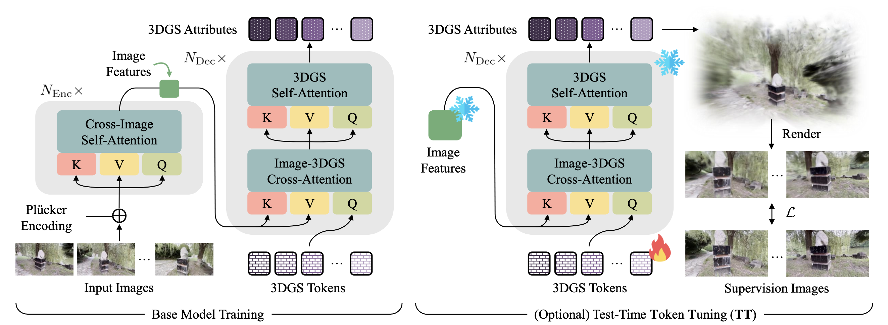

# TokenGS: Decoupling 3D Gaussian Prediction from Pixels with Learnable Tokens

arXiv：[2604.15239](https://arxiv.org/abs/2604.15239)；项目页：[TokenGS](https://research.nvidia.com/labs/toronto-ai/tokengs/)；代码：[nv-tlabs/TokenGS](https://github.com/nv-tlabs/TokenGS)

## 开始前复习一下知识点

### 1. Volume Rendering（体渲染）

这里的 volume rendering（体渲染）指：沿着相机像素发出的一条 3D 射线，把射线上各个位置的颜色按“可见性”加权累积，得到该像素的最终颜色。

对一条射线 $\mathbf r(t)$，连续形式可写作：


$$C(\mathbf r)=\int T(t)\,\sigma(\mathbf r(t))\,c(\mathbf r(t))\,dt$$


其中：

- $\sigma$：该位置的密度/不透明度；
- $c$：该位置发出的颜色；
- $T(t)$：光线到达 $t$ 前都没有被前方内容遮挡的透射率。

直觉上，近处且不透明的物体权重高，会遮住后面物体；空区域密度近零，不会影响像素。

在 TokenGS 的 3D Gaussian Splatting 实现中，连续体被一组 Gaussian 粒子离散化。对一个像素，先将与其相关的 Gaussian 按深度从近到远排序，再做 alpha compositing：

$$
C=\sum_i T_i\,\alpha_i\,c_i,\qquad
T_i=\prod_{j<i}(1-\alpha_j)
$$

这里 $\alpha_i$ 由该 Gaussian 的 opacity，以及它投影到该像素处的二维 Gaussian 值决定。也就是说，3DGS 用“投影后的椭圆 Gaussian + 深度排序混合”高效近似体渲染；它不像 NeRF 那样沿射线密集采样网络。

在 [TokenGS.pdf](/Users/pro/Desktop/🤖.ai/暑期论文阅读/key_baseline/TokenGS.pdf) 中，这一点的作用非常核心：网络预测每个 Gaussian 的中心 $\mu$、颜色、尺度、opacity 和旋转后，渲染出监督视角的图像，再用渲染图与真值图的 MSE、SSIM 损失反向传播。因此它不需要显式的 3D 点或深度监督。

这也解释了论文后面提出 visibility loss 的原因：若某个预测 Gaussian 落在所有监督相机视锥外，它对任何渲染像素都没有贡献，体渲染损失就无法给它梯度；visibility loss 专门把这类“不可见”的点拉回可被相机看到的区域。


### 2. 相机的内参和外参
相机内参和外参分别描述两件不同的事：
内参（intrinsics）：相机自身的成像规格——焦距、主点位置等。它把“相机坐标中的方向”对应到图像像素。
外参（extrinsics）：相机在世界坐标系中的位置和朝向。它把“相机坐标系”与“世界坐标系”关联起来。
常用针孔相机内参矩阵为：
$$
K=
\begin{bmatrix}
f_x&0&c_x\\
0&f_y&c_y\\
0&0&1
\end{bmatrix}
$$
其中 $f_x,f_y$ 是以像素为单位的焦距，$(c_x,c_y)$ 是图像中心附近的主点。
外参常写为：
$$
\mathbf x_{\text{cam}}=R\mathbf x_{\text{world}}+\mathbf t
$$
其中 $R\in\mathbb R^{3\times3}$ 是旋转矩阵，$\mathbf t\in\mathbb R^3$ 是平移。合起来常记为 $3\times4$ 矩阵 $[R\mid \mathbf t]$。在这个约定下，相机中心在世界坐标中为：
$$
\mathbf o=-R^\top\mathbf t
$$
注意不同代码库可能把外参定义为 world-to-camera 或 camera-to-world，公式会随之变化；但它们表达的都是“相机在哪里、朝哪里”。

### 3. 将高斯均值回归为沿相机射线方向的深度
高斯均值 $\mu$ 描述的是一个高斯体在三维空间中的具体位置，也就是： 
$$ \mu=(x,y,z)\in\mathbb{R}^3 $$
而将高斯均值回归为沿相机射线方向的深度则是 pixel-aligned 类方法的常见做法。

可以想象从相机发射出一条射线，这条射线可以由相机坐标以及相机的朝向唯一确定。这样一来，当我们有了一张确定的图片之后，朝向就可以由像素决定——我们关注哪一个像素，我们就朝向哪里。

剩下就只需要知道高斯体在射线上的具体位置（深度）就能够预测出高斯体的具体位置了，这就是该类方法的基本思想。


### 4. Plücker 坐标
Plücker 坐标（Plücker coordinates）是一种用 6 维向量表示三维空间中“一条有方向直线”的方法。本文用它来描述：每个图像像素对应的相机射线在三维世界中的位置与方向。

对某个像素，先由相机内参和外参得到：

- 相机中心（射线起点）$\mathbf o$
- 从该像素出发的单位方向 $\mathbf d$

它的 Plücker 表示通常写作：

$$\mathbf l=(\mathbf d,\mathbf m)\in\mathbb R^6,
\qquad
\mathbf m=\mathbf o\times\mathbf d$$

其中：

- $\mathbf d\in\mathbb R^3$：射线朝向哪里；
- $\mathbf m\in\mathbb R^3$：这条线相对于世界原点的“力矩”（moment），用于说明它经过空间中的什么位置。

仅有方向不够：许多相机射线可以平行，却来自不同位置。加入 $\mathbf m$ 后，方向和空间位置共同确定了这条三维直线。

```text
相机中心 o
    \
     \  d：像素对应方向
      \
       ·  三维空间中的射线

Plücker ray = [d, o × d]
```

它有一个重要性质：射线上任取一点 $\mathbf x=\mathbf o+t\mathbf d$，都有

$$\mathbf x\times\mathbf d
=
(\mathbf o+t\mathbf d)\times\mathbf d
=
\mathbf o\times\mathbf d$$

所以 $\mathbf m$ 不依赖于你在这条线上选哪个点；它描述的是整条线，而非某个特定深度点。

在 TokenGS 中，作者为每个输入视图的每个像素计算这种 6 维射线编码，然后按图像 patch 分块，得到 Plücker patches，并与 RGB 图像 patch 特征相加后输入 Transformer encoder。它传递的是：

> “这个视觉特征来自哪一张图的哪个像素，以及该像素在全局三维空间中对应哪一条观察射线。”

这对跨视图注意力很关键：模型看到两个外观相似的图像区域时，不能只凭 RGB 判断它们是否对应同一物体；Plücker 坐标额外提供了相机几何关系。

还要区分两个概念：

- Plücker 坐标告诉模型一条射线在哪里、朝哪里；
- 它不告诉模型三维点具体位于射线的哪个深度。

后者通常需要依靠多视图视差、图像内容和训练时的渲染监督推断。TokenGS 的特别之处是，它最终不把 Gaussian 中心硬限制在某一条输入射线上，而是利用这些射线几何信息作为条件，直接预测全局的 Gaussian 三维坐标。


## Introduction

### 1. 研究背景：前馈式 3DGS 重建

### 2. 现有 pixel-aligned Gaussian prediction 的局限

### 3. TokenGS 的核心问题与思路

### 4. 论文的主要贡献


## Method

### 1. 问题设定与 3DGS 参数化

### 2. Directly Regressing Gaussian Means
前面提到，传统的重建方式往往采用 pixel-aligned 策略，但这种策略在视图有限的情况下往往只能保证可见表面的准确重建，而无法完整复原场景结构。见下图：


直接回归高斯均值能够解耦高斯体与相机射线，这能够带来以下好处：
1. 模型能够支持外推与场景补全


2. 提高模型对相机位姿噪声的鲁棒性


3. 消除深度预测网络中常见的尖刺状伪影



#### 2.1 零梯度问题
采用了直接回归高斯均值的重建策略之后，就会导致一种问题——场景中会初始化出一批游离在所有相机视锥之外的高斯体。由于没有在任何一个相机视图中出现过，这些高斯体自然不会对渲染图像有任何贡献，也就不能受到渲染后图像的监督损失。这类“非活动”高斯会降低训练稳定性、浪费模型容量，并表现为场景周围悬浮的噪声点。这就是所谓了“Zero-Gradient Problem“。

#### 2.2 Visibility Loss 



为了消除零梯度问题，文章提出了一种新的损失函数——Visibility Loss 可见性损失。
以较为柔性的方式约束高斯粒子，使其至少在一个监督视图中保持可见。具体而言，文章将高斯质心

$$\mu_m=(x_m,y_m,z_m)$$

投影到所有监督视图 $I_i\in\mathcal{I}_{\mathrm{sup}}$ 的图像平面上，从而得到其图像坐标

$$(u_m^i,v_m^i)$$
将其按照图像宽度 $W$ 和高度 $H$ 进行归一化：

$$
\tilde{u}_m^i=2(u_m^i/W)-1,\qquad
\tilde{v}_m^i=2(v_m^i/H)-1. \tag{1}
$$

位于图像平面内部的点满足

$$\tilde{u},\tilde{v}\in[-1,1]$$

可见性损失度量每个高斯与最近可见边界之间的最小距离：

$$
\mathcal{L}_{\mathrm{vis}}
=
\sum_m
\min_{\mathbf{I}_i\in\mathcal{I}_{\mathrm{sup}}}
\left[
\mathrm{ReLU}\left(\left|\tilde{u}_m^i\right|-1\right)
+
\mathrm{ReLU}\left(\left|\tilde{v}_m^i\right|-1\right)
\right].
\tag{2}
$$

当某个高斯至少投影到一个视图的图像范围内部时，该惩罚项为零；否则，它会提供梯度，将该高斯拉回视野范围内。实际使用时，为避免产生伪梯度，我们将损失值裁剪为不超过常数 \(1.0\)。插图给出了这一过程的概念示意，其有效性如图 11 所示。
除新提出的可见性损失之外，我们还使用逐像素均方误差和 SSIM 损失的组合作为渲染监督：
$$
\mathcal{L}
=
\mathcal{L}_{\mathrm{MSE}}
+
\lambda_{\mathrm{SSIM}}\mathcal{L}_{\mathrm{SSIM}}
+
\lambda_{\mathrm{vis}}\mathcal{L}_{\mathrm{vis}}.
$$


### 3. Decoding Learnable Gaussian Tokens



#### 3.1 Model Architecture

这一节的目标是把“输入图像及其相机几何”变成一组**与像素数量解耦的场景级 Gaussian 表示**。整体结构采用 encoder-decoder Transformer：encoder 产生多视图 image tokens，decoder 则以一组可学习的 3DGS tokens 为 query，从图像 tokens 中读取信息并输出 Gaussian 属性。

```text
多视图 RGB 图像 + 每像素 Plücker 射线
                ↓
        ViT encoder（跨视图 image tokens）
                ↓
可学习 3DGS tokens ── cross-attention ── 读取图像证据
                ↓
      GS-token self-attention + MLP
                ↓
     每个 token 解码一组 3D Gaussians
```

**(1) 输入图像与几何编码。** 对 $N_c$ 张尺寸为 $H\times W$ 的输入图像，模型按 $p\times p$ 切分 patch，总 image-token 数量为：

$$
N_I=N_c\frac{HW}{p^2}.
$$

第 $v$ 个视图的第 $k$ 个 RGB patch $I_{v,k}\in\mathbb R^{p\times p\times3}$ 被线性投影为外观 embedding：

$$
x_{v,k}=\mathrm{Linear}(I_{v,k}).
$$

同一位置的 Plücker patch $P_{v,k}\in\mathbb R^{p\times p\times6}$ 被投影为几何 embedding：

$$
s_{v,k}=\mathrm{Linear}(P_{v,k}).
$$

二者相加，得到 encoder 输入 token：

$$
a_{v,k}=x_{v,k}+s_{v,k}.
$$

因此，每个 image token 同时携带“看到什么”的图像外观与“从哪里看到”的相机射线几何。将所有视图的 token 展平为序列后，标准 ViT 层在**所有视图之间**执行注意力，输出 image tokens：

$$
B\in\mathbb R^{N_I\times C}.
$$

**(2) 以 Gaussian tokens 查询图像。** decoder 初始化 $N_t$ 个可学习 embedding：

$$
T_{\mathrm{IN}}\in\mathbb R^{N_t\times C}.
$$

它们不是固定空间位置、图像像素或物体类别，而是一组可由当前场景信息填充的表示 slot。每个 decoder block 依次包含：

1. **image-to-GS cross-attention**：GS tokens 作为 Query，从 image tokens $B$ 的 Key/Value 中取证据；
2. **GS self-attention**：GS tokens 彼此协调，避免都描述同一局部；
3. **per-token MLP**：进一步更新每个 token。

所以，cross-attention 回答“这个 Gaussian token 应从哪些视图、哪些图像区域读信息”，self-attention 回答“不同 Gaussian token 应如何分工”。

**(3) 从 token 输出 Gaussian 属性。** 每个最终 token embedding 都经线性层解码出 $N_G=64$ 个 Gaussian，每个 Gaussian 具有 14 个属性：三维均值 μ（3 维）、颜色 $c\in\mathbb R^3$、尺度 $s\in\mathbb R^3$、opacity σ（标量）与单位四元数旋转 $q\in\mathbb H$。最终输出为：

$$
G\in\mathbb R^{(N_tN_G)\times14}.
$$

作者对不同属性施加相应的值域映射：颜色与 opacity 使用 scaled tanh，尺度使用截断 exponential，旋转四元数做单位归一化；均值采用适合直接 XYZ 回归的非线性映射。关键点在于：**Gaussian 数量由 $N_tN_G$ 决定，而不由输入图像分辨率或输入视图数直接决定。**

**(4) 为什么共享 image K/V。** 通常 $N_I\gg N_t$。若 decoder 的每一层都单独为所有 image tokens 投影并保留一套 Key/Value，深度为 $D_{\mathrm{dec}}$ 的 decoder 会产生约 $O(N_ID_{\mathrm{dec}})$ 的 image-side K/V 存储。TokenGS 让所有 decoder cross-attention 层共享 image-token 的 K/V 投影，并在 decoding 开始时只计算一次，因此这一部分降为 $O(N_I)$。各层的 Gaussian token 状态与 Query 仍会更新，故不同层依然可以用不同方式查询同一批图像证据。

为了稳定深层训练，encoder 和 decoder 均使用 LayerScale 与 QK-normalization；作者还发现，移除最终回归头之前通常使用的 layer normalization 会得到更好的重建质量。


#### 3.2 Dynamic Scene Modeling

静态场景中，一套 GS tokens 描述一个时不变的 3D 表示；动态场景则需要在不同时间 $t$ 表示运动内容。TokenGS 将原始 token 集合拆分为：

$$
T^S=\{T^S_1,\ldots,T^S_{N_s}\}\in\mathbb R^{N_s\times C},\qquad
T^D=\{T^D_1,\ldots,T^D_{N_d}\}\in\mathbb R^{N_d\times C}.
$$

- $T^S$：static tokens，表示时间不变的背景、建筑结构等；
- $T^D$：dynamic tokens，表示随时间运动或形变的内容。

对于想重建的目标时刻 $t$，只给 dynamic token 加入时间条件。先计算正弦时间编码 $τ(t)$，再经线性层映射到 token 维度：

$$
\widetilde T^D_j(t)=T^D_j+\mathrm{Linear}(\tau(t)).
$$

因此，static token 在所有时刻保持相同，而同一个 dynamic token 会随目标时间获得不同的表示。论文将这种按指定时间重建的设置称为 **bullet-time reconstruction**。

作者还在 decoder 的 GS self-attention 中施加结构化 attention mask。其方向是：

```text
static query  → 只能读取 static tokens
dynamic query → 可读取 static tokens 与 dynamic tokens
```

即动态 token 可以单向依赖静态 token，但静态 token 不读取动态 token。这个因果式归纳偏置表达的是“运动是在相对稳定的场景结构上发生的”：模型因而更容易把时不变结构与时变运动分开，同时让同一 dynamic token 在连续帧之间保留较一致的对应关系。需要注意，这种 static/dynamic 分解是由结构与重建目标诱导出来的，不等同于有显式语义或运动分割标签。

### 4. Test-Time Token Tuning

论文原文将这一节称为 **Test-Time Scaling**：训练完基础模型后，无需重新训练网络，可以按测试预算从两个互补方向提升当前场景的重建质量。

**(1) Context extension：增加测试时输入视图。** 推理时可以提供比训练时更多的 image tokens，例如训练使用 2 个视图、测试使用 4 个视图。更多视图带来额外的几何与外观证据，有利于消除遮挡、深度歧义和多视图不一致。

在常见 encoder-only、pixel-aligned 设计中，新增图像通常会直接带来更多输出 Gaussians；而 TokenGS 的 $N_t$ 与每 token 的 $N_G$ 是预先指定的，因此：

$$
\#\mathrm{GS}=N_tN_G
$$

保持不变。模型只获得更多输入信息，不必同步扩大场景表示规模。这使“输入视图数”和“Gaussian 数量”成为可独立控制的两个量。

**(2) Token tuning（TT）：增加测试时优化步骤。** 对一个具体测试场景，模型冻结网络参数与已经提取好的 image features，仅利用输入视图的自监督渲染损失微调 Gaussian token embeddings：

$$
T_{\mathrm{IN}}\leftarrow
T_{\mathrm{IN}}-\eta\nabla_{T_{\mathrm{IN}}}\mathcal L_{\mathrm{render}}.
$$

少量梯度步骤会改变 GS token 对 image tokens 的 attention 模式，进而经固定的 decoder 产生更适合该场景的 Gaussian 参数。这里调的是 token 的场景状态，而不是直接更新所有 Gaussian 属性，也不是微调整个网络；因此可以在适应当前场景的同时，保留其余网络权重所编码的跨场景先验。

```text
更多输入视图     → 提供更多观测证据（context extension）
更多 TT 步数      → 提供更多逐场景求解计算（token tuning）
```

两者共同构成本文的测试时扩展：重建质量可随输入视图数或 TT 计算预算提高。与传统从头优化全部 3DGS 参数的逐场景优化相比，TT 的可优化变量更小、初始化来自前馈模型，且 Gaussian 数量维持固定；但它仍会额外增加测试时间，不能再视为纯粹的单次前馈推理。

## Experiments

### 1. 实现细节与实验设置

### 2. 静态场景重建

### 3. 视图外推与相机位姿噪声鲁棒性

### 4. 动态场景重建

### 5. 消融实验与 Token 分析

## Conclusion
