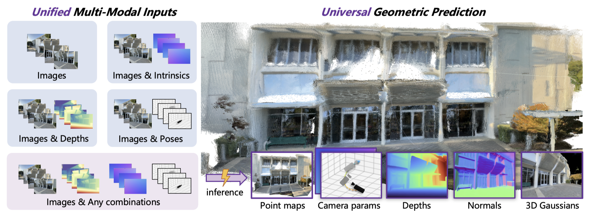
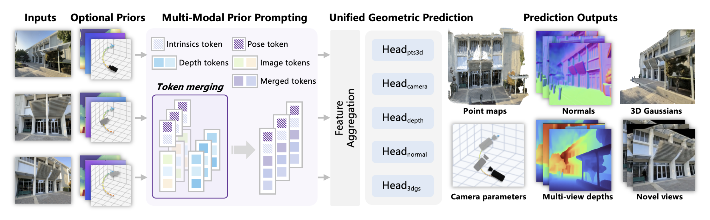
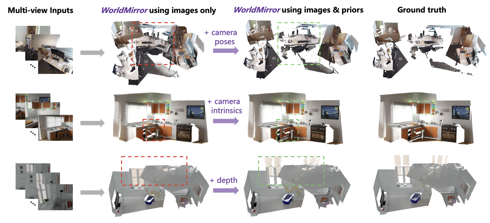

# WorldMirror: Universal 3D World Reconstruction with Any-Prior Prompting

arXiv：[2510.10726](https://arxiv.org/abs/2510.10726)；项目页：[HunyuanWorld](https://3d-models.hunyuan.tencent.com/world/)；代码：[Tencent-Hunyuan/HunyuanWorld-Mirror](https://github.com/Tencent-Hunyuan/HunyuanWorld-Mirror)

论文：[Liu 等 - 2025 - WorldMirror Universal 3D World Reconstruction with Any-Prior Prompting.pdf](/Users/pro/Desktop/🤖.ai/暑期论文阅读/key_baseline/Liu%20等%20-%202025%20-%20WorldMirror%20Universal%203D%20World%20Reconstruction%20with%20Any-Prior%20Prompting.pdf)

## 开始前复习一下知识点

### 1. 相机内参、外参与反投影

对像素齐次坐标

$$
\tilde p=(u,v,1)^\top,
$$

相机内参矩阵通常写为

$$
K=
\begin{bmatrix}
f_x&0&c_x\\
0&f_y&c_y\\
0&0&1
\end{bmatrix}.
$$

- $f_x,f_y$ 是以像素为单位的焦距，控制视野张开程度；
- $(c_x,c_y)$ 是主点，即光轴在图像上的交点；
- 外参常写为 $[R\mid t]$，其中 $R\in SO(3)$ 描述旋转，$t\in\mathbb R^3$ 描述平移。

若某像素深度为 $D(u,v)$，则它在相机坐标系中的三维位置是

$$
X_{\mathrm{cam}}
=D(u,v)K^{-1}\tilde p.
$$

若采用 camera-to-world 约定，则

$$
X_{\mathrm{world}}=R X_{\mathrm{cam}}+t.
$$

不同论文可能使用反向的 world-to-camera 约定；因此读公式时不能只看符号 $[R\mid t]$，还要确认坐标变换方向。WorldMirror 在 3DGS 的反投影步骤中使用 $K$ 与 $[R\mid t]$，但没有在方法段把坐标约定完全展开。

相机内参与位姿的共同点是：它们都是一张图的全局变量，不随像素位置而改变；深度图则不同，$D(u,v)$ 是每个像素都可能不同的稠密空间信号。这一区别直接决定了 WorldMirror 的 token 设计。

### 2. point map、深度图与表面法线各自表示什么

这三个量都和三维几何有关，但不能互相混为一谈。

| 表示 | 每个像素的输出 | 回答的问题 |
|---|---|---|
| 深度图 $D(u,v)$ | 一个标量 | 该点沿相机视线有多远？ |
| point map $P(u,v)$ | 三维坐标 $(x,y,z)$ | 该点在选定三维坐标系的什么位置？ |
| 法线图 $N(u,v)$ | 单位向量 $(n_x,n_y,n_z)$ | 该点附近的表面朝向哪里？ |

在已知相机时，深度可以反投影为 point map；对相邻三维点的两个局部切向量取叉积，可以得到法线：

$$
N(u,v)
=
\frac{
\frac{\partial P}{\partial u}
\times
\frac{\partial P}{\partial v}
}{
\left\|
\frac{\partial P}{\partial u}
\times
\frac{\partial P}{\partial v}
\right\|_2
}.
$$

深度主要约束远近，法线主要约束局部倾斜、平面性和棱边。例如，一面墙即使深度略有噪声，正确的法线仍会提示“这里应接近一个平面”；这也是 WorldMirror 将法线纳入统一预测的重要原因。

## Introduction

### 1. 研究背景

从多视图图像恢复三维世界，传统上会被拆为若干子问题：

- SfM（Structure from Motion）：估计相机运动与稀疏三维结构；
- MVS（Multi-View Stereo）：在相机已知或已估的条件下恢复稠密几何，；
- 单目 / 多视图深度估计：预测像素到相机的距离；
- 相机姿态估计：恢复多张图间的相对或绝对相机关系；
- 新视角合成（NVS）：在未观测相机位姿下渲染图像；
- 表面重建：从点云、深度或隐式场中恢复连续表面。

近年的 DUSt3R、VGGT、$\pi^3$ 等 feed-forward 几何模型试图把其中若干任务并入一次前向传播。但 WorldMirror 的问题意识不只是“多输出”，还包括：真实系统常常能拿到一部分额外几何信息，例如标定内参、SLAM pose、RGB-D 深度或 LiDAR 深度；模型应当会用这些信息，但又不能在它们缺失时失效。

### 2. 现有路线的局限

论文归纳了两个核心缺口。

1. **输入空间过窄。** 许多多视图几何网络只处理 RGB。若已知相机内参、位姿或深度，这些方法仍需从图像重新猜测一遍。特别是：
   - 内参影响投影射线与焦距歧义；
   - pose 直接限制多视图如何放入同一坐标系；
   - 深度能在无纹理、反光或遮挡区域提供像素级几何锚点。
2. **输出任务不完整。** VGGT 等模型可联合点图、深度与相机，但并未把表面法线和 3DGS 新视角合成纳入同一框架。于是“几何是否正确”和“换一个视角能否渲染正确”仍可能是两套独立能力。

这里需要做一个几何澄清：已知内参首先消除的是投影 / 焦距歧义；只给 $K$ 并不能在纯视觉条件下单独确定绝对米制尺度，尺度仍可能依赖基线、pose、深度测量或数据先验。

### 3. 本文的核心贡献

1. **Multi-Modal Prior Prompting。** 将相机 pose、内参和深度分别编码为适合其信息形态的 token，并允许任意子集缺失。
2. **Universal Geometric Prediction。** 在一个视觉 Transformer 后并行预测 point map、深度、相机、表面法线和 3DGS，使几何估计与新视角渲染共享表示。
3. **面向任意先验组合的训练策略。** 每种先验以 $0.5$ 概率随机置零；配合任务、数据和分辨率三条课程学习轴，减少训练—推理条件不一致。
4. **把 NVS 放进可验证的几何闭环。** 高斯只由 context views 生成，却必须渲染并匹配 target / novel views；这迫使网络学习能跨视图成立的几何与外观。

应当保留的边界是：本文的“universal”是在五类几何输出、三类可选输入先验和论文覆盖的数据分布内成立；它不等于对动态世界、任意传感器、任意长视频或任意分辨率都无条件通用。

## Method

### 1. 总体流程与接口

对 $N$ 张输入图像 $\{I_i\}_{i=1}^{N}$，每个视图可以附带一个可选先验子集：

$$
\mathcal S_i\subseteq
\{K_i,[R_i\mid t_i],D_i\}.
$$

整体计算可以概括为：

$$
\{I_i,\mathcal S_i\}_{i=1}^N
\xrightarrow{\text{prior prompting + visual Transformer}}
\{T_i^{\mathrm{out}}\}_{i=1}^N
\xrightarrow{\text{task heads}}
\{\hat P_i,\hat D_i,\hat E_i,\hat N_i,\hat{\mathcal G}_i\}_{i=1}^N.
$$

论文的关键不是把全部先验粗暴地拼在 RGB 后面，而是先问：该先验是全局变量还是每像素变量？其答案是：

- pose 与 intrinsics 是紧凑的全局变量 $\Rightarrow$ 各用一个 token；
- depth 是与图像 patch 空间对齐的稠密变量 $\Rightarrow$ 用稠密 depth tokens 并逐位置相加。

视觉 Transformer 汇聚跨视图特征；其后由多个 DPT（Dense Prediction Transformer）式稠密头和一个相机 Transformer 头产生不同输出。论文以 VGGT 的预训练权重初始化相关部分，但 WorldMirror 自己扩展了 normal head 和 Gaussian head。

### 2. Multi-Modal Prior Prompting

#### 2.1 相机位姿：归一化后压缩为一个全局 token

输入 pose 为 $\{[R_i\mid t_i]\}_{i=1}^N$。由于不同场景的尺度不同，论文先将平移标准化：

$$
t_i^{\mathrm{norm}}
=\frac{t_i-c}{\alpha},
$$

其中 $c$ 是相机中心集合的中心，$\alpha$ 是相机到 $c$ 的最大距离。这样做并不会恢复真实米制尺度；它的目标是让网络面对不同场景时得到数值范围稳定的相机平移。

旋转矩阵 $R_i\in\mathbb R^{3\times3}$ 被转换为四元数 $q_i\in\mathbb R^4$，再与 $t_i^{\mathrm{norm}}\in\mathbb R^3$ 拼接为七维向量，经两层 MLP 投影为

$$
T_i^{\mathrm{cam}}\in\mathbb R^{1\times D}.
$$

一个 token 足以表示 pose，原因不是它比逐像素 ray 更“信息丰富”，而是 pose 原本就是一张图共享的全局条件。将它复制到每个像素反而会增加参数和计算，并让网络把全局信息伪装成局部纹理条件。

#### 2.2 相机内参：同样使用一个 token

从

$$
K_i\longrightarrow (f_x,f_y,c_x,c_y)
$$

提取焦距和主点，再按图像宽高 $W,H$ 归一化，然后由两层 MLP 得到

$$
T_i^{\mathrm{intr}}\in\mathbb R^{1\times D}.
$$

归一化使相机 token 不必死记某个固定输入分辨率。例如，把 $f_x$ 除以 $W$ 后，网络更容易学到相对视场角而不是仅仅记住焦距的像素数值。

#### 2.3 深度：保持空间对齐的稠密 token

输入深度图先归一化到 $[0,1]$。随后，卷积核大小取为图像 patch size，将它变换到与图像 patch token 一一对齐的形状：

$$
T_i^{\mathrm{depth}}
\in
\mathbb R^{(H_pW_p)\times D}.
$$

深度 token 直接加到图像 token：

$$
T_i^{\mathrm{img}}
\leftarrow
T_i^{\mathrm{img}}+T_i^{\mathrm{depth}}.
$$

这相当于在每个图像 patch 的视觉表征上加入“这里有多远”的局部提示。它适合深度，是因为深度的空间位置本身有意义；但并不适合 pose 和 intrinsics。

#### 2.4 统一的 token 序列

因此，论文的提示 token 写为：

$$
T_i^{\mathrm{prompt}}
=
\left[
T_i^{\mathrm{cam}},
T_i^{\mathrm{intr}},
T_i^{\mathrm{img}}+T_i^{\mathrm{depth}}
\right],
\qquad
T_i^{\mathrm{prompt}}
\in\mathbb R^{(1+1+H_pW_p)\times D}.
$$

这里的方括号表示 token 序列拼接，而不是逐元素相加。这个设计将“全局几何条件”和“局部几何测量”放进同一个 Transformer 语境中，同时保留各自正确的结构。

### 3. Dynamic Prior Injection：为何任何先验组合都能工作

训练时，三种先验中的每一种都以 $0.5$ 的概率被关闭；被关闭时，相应 token 置零。若三项采样独立，则共有

$$
2^3=8
$$

种输入组合，而完全无先验的组合出现概率为

$$
P(\text{no prior})=(0.5)^3=12.5\%.
$$

这是一种条件模态 dropout。其作用是让模型不能只依赖“有 pose 才会对齐”或“有 depth 才会恢复平面”，而必须在缺少任一条件时继续从 RGB 和其他视图推断几何。

### 4. Universal Geometric Prediction

#### 4.1 point map、深度与相机

令视觉 Transformer 输出为 $T_i^{\mathrm{out}}$，图像 token 子集记为 $\hat T_i^{\mathrm{img}}$，相机 token 子集记为 $\hat T_i^{\mathrm{cam}}$。论文用 DPT heads 回归稠密几何，用 Transformer 回归相机：

$$
\hat P_i=\mathrm{DPT}_p(\hat T_i^{\mathrm{img}}),
\qquad
\hat D_i=\mathrm{DPT}_d(\hat T_i^{\mathrm{img}}),
\qquad
\hat E_i=\mathrm{Transformer}(\hat T_i^{\mathrm{cam}}).
$$

注意：$T_i^{\mathrm{cam}}$ 在有 pose 输入时承载显式条件，在无 pose 时是置零条件槽位；经过与图像 token 的 attention 后，它仍能成为用于预测 $\hat E_i$ 的全局汇聚位置。这使“给定 pose”和“预测 pose”能共享同一接口。

#### 4.2 表面法线

法线同样由一个 DPT head 预测，最后做 $\ell_2$ 归一化：

$$
\hat N_i
=
\frac{\mathrm{DPT}_n(\hat T_i^{\mathrm{img}})}
{\left\|\mathrm{DPT}_n(\hat T_i^{\mathrm{img}})\right\|_2}.
$$

很多数据集没有人工标注法线。论文将两类监督混用：

- 有法线标签的数据集：直接监督；
- 只有真值深度的数据集：先通过局部平面拟合从深度导出 pseudo normal。

这使法线任务能利用更多训练数据，也让 point / depth / normal 形成局部几何一致性约束。

#### 4.3 从图像 token 直接预测 3DGS

Gaussian head 并非先使用普通 depth head 的 $\hat D_i$，再把它改造成高斯；而是单独预测 Gaussian depth 和 Gaussian feature：

$$
\hat D_g,F_g
=
\mathrm{DPT}_g(\hat T^{\mathrm{img}}).
$$

训练时，$\hat D_g$ 结合真值相机 $K,[R\mid t]$ 反投影成 Gaussian centers $\mu_g$。其余属性由 $F_g$ 与从原图提取的外观特征共同输入卷积网络预测：

$$
\hat G
=
\mathrm{Conv}(F_g,I).
$$

预测内容包括：

- 不透明度 $\sigma_g$；
- 方向 $r_g$；
- 尺度 $s_g$；
- 球谐颜色残差 $\Delta c_g$；
- 跨视图融合权重 $w_g$。

多视图重叠会让多个像素预测到同一片表面。论文采用 voxelization 对逐像素高斯进行聚类与裁剪，减少冗余和重复叠加。

这里的“GS head 直接预测高斯位置”是一个实质设计选择：它给新视角渲染单独的几何自由度，不强迫渲染位置完全继承通用 depth head 的误差模式。

### 5. 新视角合成如何被训练出来

训练时，输入视图会被划分为 context set 与 target / novel-view set。

1. 枚举 $K$ 个候选划分；
2. 根据真值深度与相机参数计算 candidate context 对每个 target 的像素重叠率；
3. 选择重叠率最高的划分；
4. **只用 context views 构建 3D Gaussians**；
5. 将这些 Gaussians 渲染回 context 视图和 target 视图，并通过可微 rasterizer 反向传播。

即：

$$
\{I_{\mathrm{ctx}}\}
\xrightarrow{\text{GS head}}
\hat{\mathcal G}
\xrightarrow{\text{render at }E_{\mathrm{ctx}},E_{\mathrm{tgt}}}
\{\hat I_{\mathrm{ctx}},\hat I_{\mathrm{tgt}}\}.
$$

target 图像没有参与高斯生成，却参与损失；因此网络不能只记住输入图上的颜色，必须把表面位置、遮挡和外观预测得足以在新相机下成立。context 的重投影监督又防止模型为 target 合成牺牲已有观测的一致性。

候选划分按最大重叠率筛选有其合理性：它避免让模型用 context 完全看不见的区域承担不可辨识的像素误差。反面是，训练信号更偏向“具有可见对应的视角迁移”，对极大 disocclusion 或凭空补全区域的证据相对有限。

### 6. 联合损失：让不同输出彼此校验

总损失为：

$$
\mathcal L
=
\lambda_{\mathrm{points}}\mathcal L_{\mathrm{points}}
+\lambda_{\mathrm{depth}}\mathcal L_{\mathrm{depth}}
+\lambda_{\mathrm{cam}}\mathcal L_{\mathrm{cam}}
+\lambda_{\mathrm{normal}}\mathcal L_{\mathrm{normal}}
+\lambda_{\mathrm{3dgs}}\mathcal L_{\mathrm{3dgs}}.
$$

#### point、depth 与 camera

point loss 继承 VGGT 风格，同时约束数值误差和空间梯度误差，并使用不确定性项：

$$
\mathcal L_{\mathrm{point}}
=
\sum_{i=1}^{N}
\left\|
\Sigma_i^P\odot(\hat P_i-P_i)
\right\|
+
\left\|
\Sigma_i^P\odot(\nabla\hat P_i-\nabla P_i)
\right\|
-\alpha\log\Sigma_i^P.
$$

depth loss 与之类似，只是把 point map 换成深度。梯度项使模型不仅拟合平均位置，也要保留几何边缘和局部变化；不确定性正则避免模型以无限放大“不确定”来逃避误差。

相机采用 Huber loss：

$$
\mathcal L_{\mathrm{cam}}
=
\sum_{i=1}^{N}
\left\|E_i-\hat E_i\right\|_{\epsilon}.
$$

#### normal

法线使用角度型损失：

$$
\mathcal L_{\mathrm{normal}}
=
\sum_{i=1}^{N}
\alpha_l\left(1-\left|\hat N_i\cdot N_i\right|\right).
$$

对单位向量而言，点积就是夹角余弦。取绝对值意味着法线朝向翻转不会被当作不同表面方向，这适合某些只关心局部平面方向、而不依赖全局朝向的重建情形。

#### 3DGS / NVS

对 context 可见区域的 RGB 与感知外观，论文使用：

$$
\mathcal L_{\mathrm{rgb}}
=
\sum_{i=1}^{N}
\left\|I_i[M_i]-\hat I_i[M_i]\right\|
+
\lambda_{\mathrm{lpips}}
\mathrm{LPIPS}(I_i[M_i],\hat I_i[M_i]).
$$

$M_i$ 表示当前视图中从 context 可见的像素 mask。仅有 RGB 重投影会产生“漂浮高斯”：它可能在少数相机角度看起来对，却不位于可信几何表面上。因此还加入：

- $\mathcal L_{\mathrm{gsdepth}}$：约束 GS head 的深度与真值深度；
- $\mathcal L_{\mathrm{consis}}$：让 GS 渲染深度的梯度与普通 depth head 的高置信伪深度梯度一致。

最终：

$$
\mathcal L_{\mathrm{3dgs}}
=
\mathcal L_{\mathrm{rgb}}
+
\lambda_{\mathrm{gsdepth}}\mathcal L_{\mathrm{gsdepth}}
+
\lambda_{\mathrm{consis}}\mathcal L_{\mathrm{consis}}.
$$

后者使用 depth confidence 最高的 $30\%$ 像素。它的含义不是“普通 depth head 永远是真值”，而是让两个几何预测分支在最可信区域不互相矛盾。

### 7. 训练课程：先建立几何，再训练渲染头

论文给出两层互补描述。

#### 7.1 实现层面的两阶段训练

- 前 $100$ epochs：使用多模态 prior prompting 与 normal head；
- 后 $50$ epochs：用 Gaussian head 微调。

每张图的总像素数在 $100{,}000$ 到 $250{,}000$ 间动态变化，宽高比在 $0.5$ 到 $2.0$ 之间采样。训练使用 $32$ 张 H20 GPU、每 GPU $24$ 张图像；这说明该“单次前向”模型的推理形式高效，但训练并不廉价。

损失权重为：

$$
\lambda_{\mathrm{points}}=1,\quad
\lambda_{\mathrm{depth}}=1,\quad
\lambda_{\mathrm{cam}}=5,\quad
\lambda_{\mathrm{normal}}=1,\quad
\lambda_{\mathrm{3dgs}}=1,
$$

并取

$$
\lambda_{\mathrm{lpips}}=0.05,\quad
\lambda_{\mathrm{gsdepth}}=0.1,\quad
\lambda_{\mathrm{consis}}=0.1.
$$

#### 7.2 论文总结的三条课程轴

1. **任务顺序。** 从 VGGT 初始化已存在的 point / depth / camera 能力，联合训练 prior prompting；随后纳入 normal；最后冻结其余模型，仅训练 3DGS head。
2. **数据调度。** 先使用真实与合成数据的混合获得广泛分布，再用标注质量更高的合成数据微调，以降低现实标注噪声的影响。
3. **分辨率课程。** 从低分辨率输入、输出开始，稳定收敛后逐步升高分辨率，让模型再学习细节。

训练集合汇总了 $15$ 个数据集，包括 DL3DV、BlendedMVS、TartanAir、ASE、Unreal4K、Habitat、MapFree、MVS-Synth、ARKitScenes、ScanNet++、MegaDepth、Hypersim、Matterport3D、CO3Dv2、WildRGBD。它试图覆盖室内 / 室外、真实 / 合成、静态 / 动态物体等不同来源。

## Experiments

### 1. 评价任务与主结论

论文在四类任务上评估：

1. point map reconstruction：7-Scenes、NRGBD、DTU；
2. camera pose estimation：RealEstate10K、Sintel、TUM-dynamics；
3. surface normal estimation：ScanNet、NYUv2、iBims-1；
4. zero-shot NVS：RealEstate10K、DL3DV、VR-NeRF。

这里的 “zero-shot” 是指不对测试场景逐场景优化；它并不等于没有在大规模训练集上见过相似的几何和渲染监督。

#### point map

平均 Accuracy 越低越好。WorldMirror 不输入外部先验时，在 7-Scenes、NRGBD、DTU 上与现有前沿模型的对比如下：

| 数据集 | VGGT | $\pi^3$ | WorldMirror，无先验 | WorldMirror，全部先验 |
|---|---:|---:|---:|---:|
| 7-Scenes | 0.046 | 0.048 | 0.043 | 0.018 |
| NRGBD | 0.051 | 0.026 | 0.041 | 0.016 |
| DTU | 1.338 | 1.198 | 1.017 | 0.735 |

这张表支持两个分开的结论：

- WorldMirror 的 RGB-only 几何底座在 7-Scenes、DTU 上优于表中的 VGGT 与 $\pi^3$，在 NRGBD 上虽优于 VGGT，但不及 $\pi^3$；
- 先验仍然显著有用，特别是多种先验同时提供时。

因此，不能把结果概括为“无先验在所有数据集均胜过所有基线”，也不能把全先验的提升误读为“无先验能力不重要”。

#### 相机与法线

相机位姿评测中，WorldMirror 在 RealEstate10K 上的 RRA / RTA / AUC@30 为 $99.99/95.81/86.28$，在 TUM-dynamics 上的 ATE 为 $0.010$。Sintel 的表现竞争力较强但不绝对最佳；论文将其与训练集中动态室外场景相对不足联系起来。

法线评测中，WorldMirror 在 ScanNet 上的平均 / 中位角误差为 $13.8^\circ/7.3^\circ$，在 NYUv2 和 iBims-1 上也具有强竞争力。需要保留细节：在 iBims-1 的 $30^\circ$ 阈值准确率上，它为 $83.7\%$，略低于 StableNormal 的 $83.9\%$；这不是所有法线指标上的绝对全胜。

#### 新视角合成

NVS 使用 PSNR（高更好）、SSIM（高更好）和 LPIPS（低更好）。在没有外部先验输入时，WorldMirror 相对 AnySplat 的 PSNR 改善明显：

| 测试设置 | AnySplat | WorldMirror |
|---|---:|---:|
| RealEstate10K，2 输入视图 | 17.62 | 20.62 |
| DL3DV，8 输入视图 | 18.31 | 20.92 |
| RealEstate10K，32 输入视图 | 19.96 | 25.14 |
| DL3DV，64 输入视图 | 18.40 | 21.25 |

输入 intrinsics 与 pose 后，RealEstate10K 的两视图 PSNR 达到 $22.30$，LPIPS 为 $0.155$。Table 4 展示的是 intrinsics / pose 组合，不展示 depth prior 的 NVS 结果。

在 NVS 指标的计算中，论文沿用 AnySplat 的 test-time camera pose alignment。它有助于公平比较相对几何与渲染质量，但也意味着这些数字不能直接等同于“完全没有相机坐标对齐时的绝对定位精度”。

### 2. 不同先验各自解决什么歧义

论文的 Figure 5 与 Figure 6 给出了直观和定量证据。

#### 2.1 读图：每种先验主要在纠正什么

这张 Figure 5 将同一模型的“仅图像”结果与“图像加一种先验”的结果并列，并以真值作参照。三行使用的是不同场景，因此它**不是**“哪种先验最重要”的严格横向排名；它的价值在于建立“哪类物理信息主要解除哪类几何歧义”的直觉。

| 加入的先验 | 它在几何链条中补充什么 | 图中主要改善 | 最直观的理解 |
|---|---|---|---|
| camera poses | 多个视图之间的旋转、平移与共同坐标系 | 上行红框中的跨视图错位、断裂和重复结构明显缓解；绿色框区域更接近真值的全局布局 | 告诉模型“每张照片是从哪里、朝哪里拍的”，因此首先改善**全局对齐** |
| camera intrinsics | 像素对应的成像射线，尤其是焦距和透视关系 | 中行红框内的桌椅 / 柜体等局部投影形状更规整，透视与图像边缘附近的几何更合理 | 告诉模型“同一个像素对应哪一条三维视线”，因此首先改善**投影几何** |
| depth | 每个像素沿视线的距离 | 下行红框中原本不完整、含混的桌面与背景局部结构得到补全和稳定；绿色框区域的平面与遮挡关系更接近真值 | 直接告诉模型“沿这条视线走多远”，因此首先改善**局部距离与表面完整性** |

三者可以用同一个反投影关系串起来：

$$
X_{\mathrm{world}}
=R\bigl(D(u,v)K^{-1}\tilde p\bigr)+t.
$$

- $K$ 决定从像素 $\tilde p$ 出发的**射线方向**；
- $D(u,v)$ 决定沿该射线走多远；
- $(R,t)$ 决定不同相机坐标系如何变换到共同世界坐标系。

因此，Figure 5 的三个现象并非偶然：pose 主要消除“多张图怎样拼到一起”的歧义，intrinsics 主要消除“图像是用什么投影拍出来的”的歧义，depth 则主要消除“表面究竟离相机多远”的歧义。它们是互补的，而不是相互替代的。

> 读图时还要注意：图中每一行只额外加入一种先验，不代表其余两种先验不存在价值；当三者同时提供时，Table 1 的点图结果通常进一步提升。反过来，仅给 $K$ 不能保证绝对米制尺度，仅给深度也未必能完全纠正全局相机配准。

- **给 pose**：能明显改善跨视图相对位置与全局结构对齐；
- **给 intrinsics**：能提供正确的投影模型，尤其改善焦距、投影和图像边缘几何；它本身不保证绝对米制尺度；
- **给 depth**：给出逐像素距离约束，在强透视、弱纹理、遮挡和复杂局部结构中尤其有帮助。

Figure 6 的重点不只是“给什么先验就提升什么任务”。单一模态往往也提升其他几何输出：例如 pose 信息能帮助 point / depth 对齐，depth 也能帮助相机和点图推断。原因是这些输出在同一个三维解释中互相耦合。

### 3. 决定性消融

#### 3.1 先验嵌入：验证“全局先验用单 token”的合理性

Table 5 比较了两种位姿 / 内参的编码方式：

| 输入先验 | 稠密方案 | 论文方案 |
|---|---|---|
| pose | 将每像素 Plücker ray 加到 image tokens | 一个 pose token 拼接到序列 |
| intrinsics | 将每像素 ray map 加到 image tokens | 一个 intrinsic token 拼接到序列 |

单 token 的额外参数远低于稠密条件：

- pose：$1.06$M vs. $9.02$M，综合平均分 $61.06$ vs. $60.44$；
- intrinsics：$1.06$M vs. $6.65$M，综合平均分 $68.96$ vs. $66.58$。

因此它直接支持的设计结论是：**对本质为全局低维变量的 pose / intrinsics，紧凑 token 拼接比稠密逐像素条件更有效率、综合表现更好。**

该表并未直接比较 depth 的“空间 token 相加”与其他编码法，也未隔离检验动态 prior injection；不要把它扩展成“所有先验都应只用一个 token”。

#### 3.2 NVS：哪一项真的重要

Table 6 测试三种替换：

1. “w/o GT Cameras”：用 camera head 的预测相机取代用于 3DGS 位置和渲染的真值相机；
2. “w/o Novel Views”：只监督输入 / context views，不监督 target novel views；
3. “w/o GS DPT”：不用独立 Gaussian depth，改用普通 depth head 的深度确定高斯位置。

最稳定、最显著的结论来自第二项：去掉 novel-view loss 后，RealEstate10K 两视图 PSNR 从 $20.29$ 降到 $18.51$，SSIM 从 $0.693$ 降到 $0.651$；这直接说明“让 context 构造的场景去重渲染 target”是 NVS 能力的关键监督。

相机与独立 GS-DPT 的消融也整体支持论文设计，但并非每个数据集、每个指标都单调下降。例如“w/o GT Cameras”在 RealEstate10K 的 PSNR 与完整模型接近，却在 DL3DV、VR-NeRF 有更明显损失；“w/o GS DPT”在部分 LPIPS 指标甚至略好。因而应把结论理解为“它们提升总体折中和鲁棒性”，而不是“每项指标都由单一模块严格支配”。

#### 3.3 predicted normals 用于表面重建

Figure 7 用 Poisson surface reconstruction 展示：用模型预测的 normal map 作为额外信息时，表面更平整且细节更清晰。该证据主要是定性可视化，支持“法线可服务下游表面重建”，但不等于给出了覆盖各种重建算法的定量保证。

### 4. 为什么无先验时仍强于 VGGT 等方法

这个结果的正确解释不是“先验模块在没有先验时仍偷偷输入了信息”，而是以下因素共同把几何能力写进了共享权重。

1. **VGGT 初始化。** WorldMirror 的 point / depth / camera 部分从 VGGT 预训练权重出发，不是从零训练；它继承了强的视觉几何基础。
2. **多任务几何闭环。** point、depth、camera、normal 和 3DGS 不是相互无关的标签。任何一个错误都会通过其他损失暴露：错误 pose 难以解释一致 point map，错误几何难以在 target 相机重渲染正确图像。
3. **明确见过 RGB-only 条件。** 随机关闭先验使完全无先验组合约占训练样本的 $12.5\%$；此时模型仍受到几何和渲染监督，必须从 RGB 推断缺失信息。
4. **数据与课程更强。** $15$ 个真实 / 合成数据集、分辨率 warm-up 和高质量合成微调共同改善泛化。
5. **NVS 提供跨视图外观约束。** 相比只回归 point / depth，target-view 渲染损失进一步筛掉“单视图看似正确、换视角就破裂”的几何。

不过，论文没有给出一个把“更多训练数据、更多任务、VGGT 初始化、prior dropout、3DGS 损失”逐一完全控制的消融。因此更严谨的表述是：

> WorldMirror 的无先验性能反映了一个更强的、由多任务与多分布训练得到的 RGB 几何基座；prior prompting 是在这个基座上进一步降低外部几何歧义的可选接口。

### 5. 成本、边界与待验证点

1. **动态场景与自动驾驶不足。** 论文明确承认训练分布中动态和城市场景不足，导致这些场景表现不理想；它的主问题仍接近静态多视图重建。
2. **分辨率与长序列受限。** 当前输入分辨率范围约为 $300$–$700$ 像素，且不适合数千个输入视图；消费级 GPU 的显存 / 计算限制会更明显。
3. **NVS 训练依赖干净的相机监督。** 默认 Gaussian center 的反投影使用真值 $K,[R\mid t]$。预测相机消融表明该替代方案可工作，但更严格的 pose-free NVS 证据应与默认真值相机构建流程分开解读。
4. **先验可用性与质量未被充分压力测试。** 动态注入处理的是“缺失”，不是严重错误的 pose、偏置深度或错误内参。真实系统中，低质量先验可能比完全缺失更棘手。
5. **多任务的因果贡献未完全分离。** 表面法线、3DGS 训练、数据规模和初始化同时变化，现有消融更有力地验证了 token 形式和 NVS 监督，而不是逐项量化每个改动对无先验底座的贡献。
6. **指标协议影响解释。** NVS 使用 test-time pose alignment，表面重建图也以可视化为主；这些证据支持相对几何与渲染质量，但不能直接外推为绝对尺度、实时性或动态鲁棒性保证。
7. **法线方向的细节。** normal loss 使用 $|\hat N\cdot N|$，对 $N$ 与 $-N$ 不敏感；而某些下游算法需要朝向一致的法线。这种“无符号监督”与 Poisson 重建所需的有向法线之间如何衔接，值得在复现时确认。

## Conclusion

WorldMirror 的核心不是“给 Transformer 塞进更多传感器数据”，而是为不同物理结构的信息设计匹配的提示接口，并让多个几何输出共同约束同一个三维解释：

> 多视图 RGB  
> $\downarrow$  
> 可选地加入全局 pose / intrinsics token 与稠密 depth token  
> $\downarrow$  
> visual Transformer 聚合跨视图信息  
> $\downarrow$  
> point map、深度、相机、法线、3D Gaussians 联合预测  
> $\downarrow$  
> 由 context 构建场景，并在 context 与 target 视图共同验证

最值得迁移到其他工作中的想法有四点：

1. **按先验的物理结构设计 token，而非一律拼接。** 全局、低维相机变量适合 compact token；空间对齐测量适合 dense token。
2. **把“可选输入”当作条件缺失问题训练。** 通过随机关闭模态，让同一模型覆盖有 / 无先验，而不是维护两套网络。
3. **让输出之间构成可检验的几何闭环。** point map、深度、法线、相机和渲染并行监督比单独堆叠多个 head 更有意义。
4. **用 novel-view render loss 训练真正可渲染的三维表示。** 若只重投影输入视图，模型可能记住观测；只有把未输入的 target 视图纳入损失，才直接约束新视角一致性。
